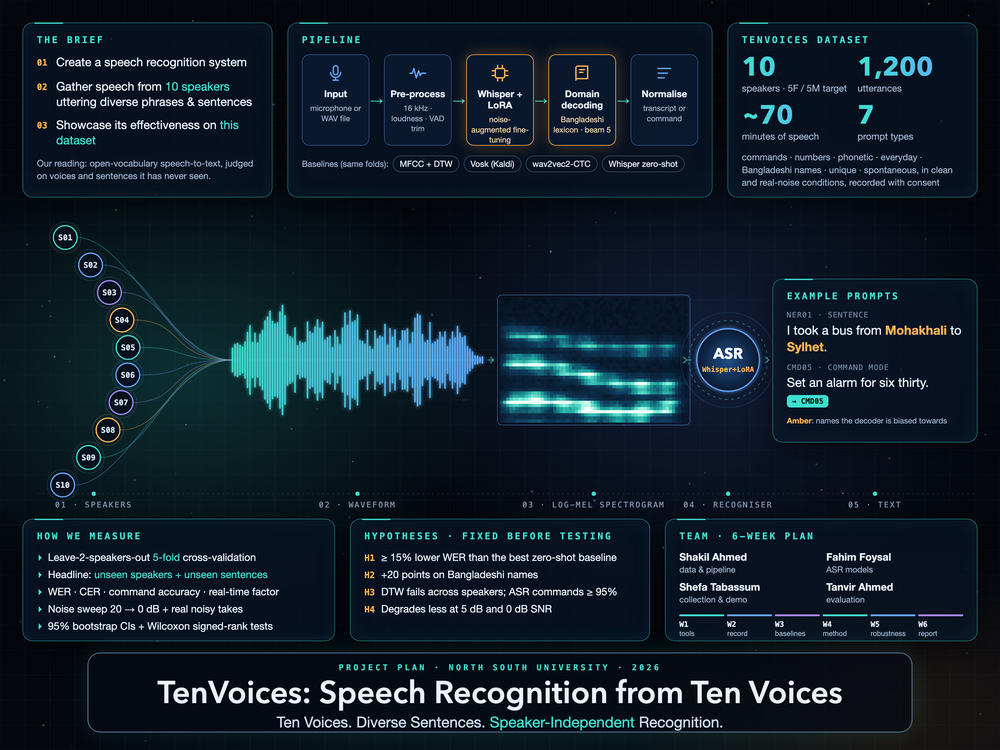

# 🎙️ TenVoices: Speech Recognition on a Self-Collected 10-Speaker Dataset

### Speech Recognition Systems · Course Project
**University Project | North South University (NSU)**


| Course | Section | Group | Instructor |
| :---: | :---: | :---: | :---: |
| *TBD* | *TBD* | *TBD* | *TBD* |

<p align="center">
  
</p>

<p align="center">
  <em>Project poster (planning edition).</em>
</p>

> 📋 **Status: planning stage.** This repository contains:
> - the project plan
> - the data-collection protocol
> - the draft prompts
> - the poster
>
> Code, data and results will be added week by week (see the roadmap below).

## 📖 Overview
This project builds a **speech recognition system** that converts spoken English into text. We evaluate it on **TenVoices**, a dataset we record ourselves from **10 speakers** uttering diverse phrases and sentences.

We compare three families of methods on the same data:
* **Traditional machine learning:** MFCC features with k-NN, SVM, Random Forest and XGBoost, plus DTW template matching, on a 15-command recognition task.
* **Pre-trained deep learning models (zero-shot):** Vosk (Kaldi), wav2vec 2.0 and Whisper, transcribing every utterance.
* **Our approach:** Whisper fine-tuned with LoRA and noise augmentation, decoded with a lexicon of Bangladeshi places and names.

Every result is measured on **speakers the system has never heard, reading sentences it has never seen**, using leave-2-speakers-out 5-fold cross-validation.

---

## 📊 Dataset
We are recording our own dataset, **TenVoices v1**.
* **Speakers:** 10 adults (4 team members + 6 volunteers), target 5 female / 5 male. They read English with a natural Bangladeshi accent.
* **Size:** 120 recordings per speaker, so **~1,200 utterances (~70 minutes)** in total.
* **Prompt types:**
    * *Voice commands* (15, each recorded twice), e.g. "Turn off the fan."
    * *Numbers, times and money* (10), e.g. "Please pay five hundred and fifty taka at the counter."
    * *Phonetically rich Harvard sentences* (15)
    * *Everyday sentences and questions* (10)
    * *Bangladeshi names and places* (10), e.g. "I took a bus from Mohakhali to Sylhet."
    * *Unique sentences* (30 per speaker, 300 in total, never repeated across speakers)
    * *Spontaneous answers* (5 short unscripted answers)
    * *Real-noise re-recordings* (10 prompts recorded again in a noisy place)
* **Held-out text:** half of each shared sentence category is never used for training, so the test sentences stay unseen.
* **Format:** WAV recorded at 48 kHz, processed to 16 kHz mono. Speakers are identified only by pseudonymous IDs (S01–S10).
* **Consent & licence:** every speaker signs a consent form. Recordings of speakers who opt in will be released under **CC BY 4.0**.

Draft prompts: [data/prompts/prompts_v0.csv](data/prompts/prompts_v0.csv) · Recording rules: [docs/DATA_COLLECTION_PROTOCOL.md](docs/DATA_COLLECTION_PROTOCOL.md)

---

## 🧠 Methodology

### 1. Traditional Machine Learning (Baseline)
This is a closed-set **command recognition** task: decide which of the 15 voice commands was spoken.
* **Feature Extraction:** Librosa MFCCs (13) + Δ + ΔΔ, summarised by mean and standard deviation over three equal time segments, so that word order is partly kept.
* **Models:** k-NN, SVM, Random Forest and XGBoost on the MFCC statistics, and DTW template matching on the full MFCC sequences.
* **Expected limitation:** handcrafted features capture the speaker's voice as much as the words, so accuracy should drop on unseen speakers.

### 2. Pre-trained Deep Learning Models (Zero-Shot)
These models transcribe every utterance with an open vocabulary, without any training on our data.
* **Vosk** small English model (Kaldi hybrid HMM-DNN with an n-gram language model)
* **wav2vec 2.0 base** (`facebook/wav2vec2-base-960h`, CTC decoding)
* **Whisper** tiny, base and small (`openai/whisper-*`, encoder–decoder transformer)
* For the command task, each transcript is matched to the closest command (fuzzy matching with a rejection threshold).

### 3. Our Approach: Adapted Whisper (Fine-Tuning)
* **Pre-processing:** mono 16 kHz, loudness normalisation, Silero VAD trimming of silence.
* **Architecture:** Whisper-small with **LoRA** adapters on the attention layers, so only ≈ 1–2% of the weights are trained.
* **Training (planned):**
    * Speaker-independent: trained on 7 speakers per fold and early-stopped on 1 dev speaker
    * Optimizer: AdamW, with the learning rate tuned on the dev speaker
    * Epochs: up to 5, with early stopping
    * Batch size: 8 (gradient accumulation if memory is short)
    * **Augmentation:** real recorded background noise and white noise at 5–20 dB SNR, speed 0.9–1.1×, gain ±6 dB
* **Domain-aware decoding:** beam search (beam 5). The decoder is prompted with a list of Bangladeshi districts, places and names, built from public lists before any testing.
* **Hardware:** Google Colab GPU (T4) or Apple Silicon (MPS) for training; laptop CPU for the speed benchmark.

---

## 📏 Evaluation Protocol
* **Leave-2-speakers-out 5-fold cross-validation:** each fold has 2 test speakers, 1 dev speaker and 7 training speakers, and every speaker is tested exactly once.
* **Headline subset:** test speakers reading **sentences that never appear in training**.
* **Metrics:**
    * Word Error Rate (main metric), Character Error Rate, sentence error rate
    * Named-entity accuracy
    * Command accuracy and macro F1
    * Real-time factor
* **Statistics:** paired bootstrap 95% confidence intervals and Wilcoxon signed-rank tests over speakers.
* **Robustness:** noise added at 20 / 10 / 5 / 0 dB, plus the real noisy recordings.

---

## 🏆 Results & Performance (planned)
The results will be filled in after the experiments in Weeks 3–5. **Nothing below is a measured result yet.**

| Model | Type | Command Accuracy | Macro F1 | WER (unseen speakers + sentences) | CER |
| :--- | :--- | :---: | :---: | :---: | :---: |
| MFCC + k-NN | Traditional ML | TBD | TBD | — | — |
| MFCC + SVM | Traditional ML | TBD | TBD | — | — |
| MFCC + Random Forest | Traditional ML | TBD | TBD | — | — |
| MFCC + XGBoost | Traditional ML | TBD | TBD | — | — |
| MFCC + DTW | Template matching | TBD | TBD | — | — |
| Vosk (Kaldi) | Hybrid ASR, zero-shot | TBD | TBD | TBD | TBD |
| wav2vec 2.0 base | Deep learning, zero-shot | TBD | TBD | TBD | TBD |
| Whisper tiny / base / small | Deep learning, zero-shot | TBD | TBD | TBD | TBD |
| **Whisper-small + LoRA + lexicon (ours)** | **Fine-tuned** | **TBD** | **TBD** | **TBD** | **TBD** |

**Hypotheses** (fixed before testing; reported whether or not they hold):

| ID | Hypothesis |
| :---: | :--- |
| H1 | Our approach lowers WER by ≥ 15% relative to the best zero-shot model, and the 95% CI excludes 0 |
| H2 | Domain-aware decoding improves accuracy on Bangladeshi names and places by ≥ 20 points |
| H3 | On unseen speakers, ASR-based command recognition reaches ≥ 95% and beats every MFCC classifier |
| H4 | Noise-augmented fine-tuning keeps WER below the zero-shot model at 5 dB and 0 dB SNR |

**Planned figures:**
* WER comparison with confidence intervals
* Per-speaker WER heatmap
* Command confusion matrices
* WER vs SNR curve

---

## 🗓️ Development Roadmap
- Week 1: Planning, repository setup, recording tool and pilot recordings.
- Week 2: Dataset collection from 10 speakers, quality control and transcripts.
- Week 3: Pre-processing, MFCC features, traditional ML baselines and zero-shot ASR.
- Week 4: Our approach: domain-aware decoding, noise augmentation and LoRA fine-tuning.
- Week 5: Speaker-independent experiments, noise robustness, error analysis and demo app.
- Week 6: Demo video, report, slides, poster and final polish.

Tasks, owners, dependencies and progress: [docs/STATUS.md](docs/STATUS.md).

---

## 📁 Repository Structure (planned)
```text
Voices-Speech-Recognition-445/
|-- CLAUDE.md                   instructions for Claude Code (read every session)
|-- main.py                     transcribe / evaluate / reproduce
|-- app.py                      Gradio live demo
|-- requirements.txt
|-- configs/                    config.yaml, lexicon_bd.txt
|-- support/
|   |-- config.py, audio.py, dataset.py                       M1
|   |-- asr.py, decoding.py, finetune.py                      M1
|   |-- features.py, augment.py                               M2
|   |-- classical/  knn, svm, random_forest, xgboost_model, dtw  M2
|   |-- metrics.py, commands.py, stats.py, experiments.py     M3
|   `-- visualization.py                                      M4
|-- tools/                      recorder.py, qc_report.py (M2), make_splits.py (M1)
|-- notebooks/                  Colab notebook for LoRA fine-tuning
|-- tests/
|-- data/                       prompts, metadata, splits (audio is gitignored)
|-- results/                    small result tables, committed for handoffs
|-- docs/                       STATUS.md, PROJECT_PLAN.md, protocol, consent form, templates
|-- poster/poster.html          poster source
|-- images/                     poster and figures
|-- outputs/                    large generated files (gitignored)
`-- others/                     report, slides, demo video
```

---

## 🛠️ Installation

1.  **Clone the repository:**
    ```bash
    git clone https://github.com/minhaz-42/Voices-Speech-Recognition-445.git
    cd Voices-Speech-Recognition-445
    ```

2.  **Create a virtual environment (Recommended):**
    ```bash
    python -m venv venv
    # Windows
    .\venv\Scripts\activate
    # Mac/Linux
    source venv/bin/activate
    ```

3.  **Install dependencies:**
    ```bash
    pip install -r requirements.txt
    ```

---

## 🚀 Usage (planned)
The code is not written yet. These are the planned entry points; each will be documented here once it works.

| Command | Purpose | Planned for |
| :--- | :--- | :---: |
| `python tools/recorder.py` | Record the prompts of one speaker session | Week 1 |
| `python main.py transcribe --audio <file.wav> --model whisper-small` | Transcribe one audio file | Week 3 |
| `python main.py evaluate --config configs/exp_main.yaml` | Run an experiment over all 5 folds | Week 4 |
| `python app.py` | Live microphone demo (Gradio) | Week 4 |
| `python main.py reproduce` | Regenerate every table and figure | Week 5 |

---

## 🔮 Future Work
* **Bangla and code-switched speech:** extend TenVoices with Bangla sentences and mixed Bangla–English speech.
* **More speakers and devices:** grow beyond 10 speakers and measure how results scale.
* **Streaming recognition:** real-time transcription in the demo.
* **On-device deployment:** distilled or quantised models that run on a phone.

---

## 🔒 Ethics & Privacy
* **Consent:** every speaker signs a consent form ([docs/consent_form.md](docs/consent_form.md)). Public release is a separate opt-in, and speakers can withdraw before release.
* **Pseudonymity:** no names, phone numbers or student IDs are stored.
* **Storage:** raw audio stays in a private team folder and is never committed to this repository.

---

## 🔄 Team Workflow (Claude Code)
Every member works through Claude Code, one after another:
1. **Pull** the latest `main` and open Claude Code in the repository.
2. **Ask:** *"I'm M2. What is completed?"* Claude reads [CLAUDE.md](CLAUDE.md) and the task board in [docs/STATUS.md](docs/STATUS.md).
3. **Continue:** *"Complete my next tasks."* Claude only starts tasks whose dependencies are done.
4. **Wrap up:** *"Wrap up and push."* Claude runs the tests, updates the task board and handoff log, commits and pushes.
5. The next member pulls and repeats.

---

## 👥 Contributors
* **Tanvir Ahmed** - *team lead (Member 1): data pipeline, ASR models and our approach, integration*
* **Md. Shahriar Rakib Rabbi** - *Member 2: dataset collection and curation, traditional ML baselines, noise augmentation*
* **Tanvir Ahmed** - *Member 3: evaluation (metrics, experiments, statistics, error analysis)*
* **Tanvir Ahmed** - *Member 4: demo app, figures, poster and video*

Member 3 and Member 4 are open slots for members who join later; Tanvir Ahmed covers them for now.

---

## 📄 License
* **Code:** [MIT](LICENSE).
* **TenVoices audio and transcripts:** CC BY 4.0, for speakers who opt in, once released.
* **Prompt sources:** Harvard sentences (IEEE 1969) and Mozilla Common Voice sentences (CC0).
