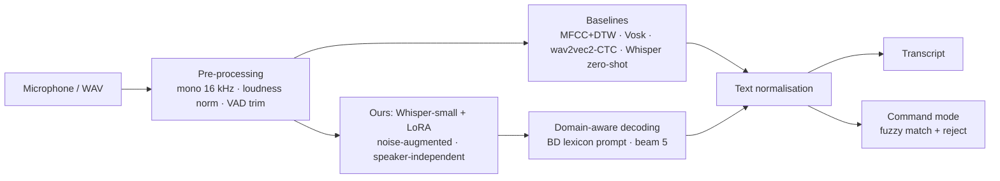

# TenVoices: Speaker-Independent Speech Recognition on a Self-Collected 10-Speaker Dataset


> **Status: planning complete. Implementation starts on Day 1 (Sat 3 Oct 2026).**
> This repository currently holds the full project plan, the data-collection protocol, the draft prompts and the poster. Code, data and results will be added day by day following [docs/DAILY_PLAN.md](docs/DAILY_PLAN.md).

## Project Information

| Item | Details |
| --- | --- |
| Course | *TBD (filled in at kick-off)* |
| Section | *TBD* |
| Group | *TBD* |
| Instructor | *TBD* |
| University | North South University (NSU), Dhaka, Bangladesh |
| Duration | 6 weeks · 3 Oct – 13 Nov 2026 |

## Team Members

| Member | Name | Primary Responsibility |
| --- | --- | --- |
| Member 1 | Shakil Ahmed | Repository, configuration, audio pre-processing, dataset loader and splits, integration (`main.py`) |
| Member 2 | Fahim Foysal | ASR engines (Whisper, wav2vec2, Vosk), domain-aware decoding, LoRA fine-tuning |
| Member 3 | Shefa Tabassum | Data collection (recorder tool, protocol, consent), augmentation, visualisation, demo app, poster |
| Member 4 | Tanvir Ahmed | Metrics, classical MFCC + DTW baseline, experiment runner, statistics, error analysis |

<p align="center">
  
</p>

<p align="center">
  <em>Project poster (planning edition). The results edition replaces it in Week 6.</em>
</p>

## Short Overview

TenVoices is a semester project to **build a speech recognition system, record our own dataset of 10 speakers, and prove on that dataset how well the system works.**

- **System:** a speech-to-text pipeline. It pre-processes the audio (16 kHz, loudness normalisation, voice-activity trimming), recognises it with **Whisper adapted through noise-augmented LoRA fine-tuning**, and decodes with a **Bangladeshi names-and-places lexicon**. A closed-set command mode is included.
- **Dataset:** **TenVoices v1**, about 1,200 utterances (~70 min) from 10 consenting speakers. It covers voice commands, numbers, phonetically rich sentences, everyday questions, Bangladeshi names and places, 300 unique sentences, spontaneous answers, and real-noise recordings.
- **Evaluation:** every number is measured on **speakers the system has never heard, reading sentences it has never seen**, using leave-2-speakers-out 5-fold cross-validation. We compare against classical (MFCC + DTW), hybrid (Vosk/Kaldi) and modern (wav2vec2, Whisper) recognisers, with confidence intervals and significance tests.

## Problem Statement

The project brief:

> *Create a speech recognition system. Gather a dataset consisting of speech samples from 10 speakers uttering diverse phrases or sentences. Showcase the effectiveness of your method using this dataset.*

We read *speech recognition* as automatic speech-to-text with an open vocabulary, which is what "diverse phrases or sentences" calls for. Effectiveness only counts if it holds for **new voices and new sentences**; otherwise a model can look good by memorising.

Our speakers are Bangladeshi and read English with their natural accent. Accented speech, local names and real background noise are exactly where off-the-shelf recognisers tend to struggle, which makes this a meaningful test.

## Objectives and Research Questions

| | |
| --- | --- |
| **O1** | Build TenVoices v1 (10 speakers, ~1,200 utterances) with consent, metadata and quality control |
| **O2** | Build a working recogniser with a command-line tool and a live demo |
| **O3** | Measure its effectiveness against classical and modern baselines with a speaker-independent protocol |
| **O4** | Release code, data and results openly and reproducibly |
| **RQ1** | How well do off-the-shelf recognisers transcribe Bangladeshi-accented English from unseen speakers? |
| **RQ2** | Does our adaptation (VAD + domain-aware decoding + noise-augmented LoRA) reduce errors on unseen speakers *and* unseen sentences? |
| **RQ3** | Which speakers, prompt types and noise levels still cause errors? |

## The TenVoices Dataset (planned)

| Block | Prompts | Recordings per speaker | Purpose |
| --- | --- | --- | --- |
| Voice commands (CMD) | 15 shared | 30 (2 repetitions) | Closed-set recognition; speaker-dependent vs speaker-independent DTW |
| Numbers, times, money (NUM) | 10 shared | 10 | Digits and number normalisation |
| Phonetically rich, Harvard sentences (PHO) | 15 shared | 15 | Phonetic coverage |
| Everyday sentences and questions (EVQ) | 10 shared | 10 | Conversational read speech |
| Bangladeshi names and places (NER) | 10 shared | 10 | Out-of-vocabulary entities |
| Unique sentences (UNQ) | 30 per speaker (300 in total) | 30 | Lexical diversity; never repeated across speakers |
| Spontaneous answers (SPN) | 5 topics | 5 | Unscripted speech |
| Real-noise re-recordings | 10 flagged prompts | 10 | Real-world robustness |
| **Total** | | **120 × 10 speakers = 1,200** | |

Half of each shared category is **held-out text** that is never used for training, so test sentences stay unseen. Recording rules, metadata schemas, QC and privacy are in [docs/DATA_COLLECTION_PROTOCOL.md](docs/DATA_COLLECTION_PROTOCOL.md); the draft prompts are in [data/prompts/prompts_v0.csv](data/prompts/prompts_v0.csv). Audio is never committed to git. Recordings from speakers who opt in will be released under **CC BY 4.0** as a GitHub Release asset.

## Method (planned)



- **Pre-processing:** mono, 16 kHz, −23 LUFS loudness normalisation, Silero VAD trimming.
- **Adaptation:** LoRA adapters on Whisper-small (≈ 1–2% of the weights), trained per fold on 7 speakers and early-stopped on 1 dev speaker. Training audio is augmented on the fly with real recorded noise at 5–20 dB SNR, speed and gain changes.
- **Domain-aware decoding:** the decoder is prompted with a fixed lexicon of Bangladeshi districts, places and names, built from public lists before any test decoding.
- **Command mode:** the transcript is fuzzy-matched to 15 known commands, with a rejection threshold.

## Baselines and Experiments (planned)

| ID | Experiment | Compared systems | Main metric |
| --- | --- | --- | --- |
| E1 | Classical recogniser | MFCC + DTW, speaker-dependent vs speaker-independent | Command accuracy |
| E2 | Off-the-shelf ASR | Vosk (Kaldi), wav2vec2-base-960h, Whisper tiny / base / small | WER, CER |
| E3 | Our method | Whisper-small + VAD + domain decoding + LoRA (5 folds) | WER vs best baseline |
| E4 | Ablations | Without VAD / prompt / LoRA / augmentation; model sizes | WER |
| E5 | Command recognition | DTW vs ASR + matching, clean vs noisy | Accuracy, rejection rate |
| E6 | Noise robustness | Added noise at 20 / 10 / 5 / 0 dB + real noisy recordings | WER vs SNR |
| E7 | Error analysis | Per speaker, per prompt type, named entities, error types | Tables and examples |
| E8 | Efficiency | Laptop CPU vs GPU | Real-time factor, latency, size |

## How Effectiveness Will Be Measured

- **Speaker-independent 5-fold cross-validation:** each fold has 2 test speakers, 1 dev speaker and 7 training speakers, so every speaker is tested exactly once.
- **Headline subset:** test speakers reading sentences that never appear in training.
- **Metrics:** word error rate (primary), character error rate, sentence error rate, named-entity accuracy, command accuracy, real-time factor.
- **Statistics:** paired bootstrap 95% confidence intervals and a Wilcoxon signed-rank test over speakers.
- **Hypotheses**, frozen before the main experiments and reported whether or not they hold:

| ID | Hypothesis | Pass criterion |
| --- | --- | --- |
| H1 | Our pipeline beats the best zero-shot baseline | ≥ 15% relative WER reduction, CI excludes 0 |
| H2 | Domain-aware decoding fixes Bangladeshi names | +20 points named-entity accuracy |
| H3 | Template matching fails across speakers; ASR commands don't | DTW drops ≥ 20 points; ASR commands ≥ 95% |
| H4 | Noise-augmented adaptation is more robust | Lower WER than zero-shot at 5 dB and 0 dB |

## Planned Repository Structure

```text
TenVoices-Speech-Recognition/
|-- main.py                 (Week 3) CLI: transcribe / evaluate / reproduce
|-- app.py                  (Week 4) Gradio live demo
|-- README.md
|-- requirements.txt
|-- LICENSE                 MIT (code)
|-- configs/                config.yaml, lexicon_bd.txt, experiment configs
|-- support/                config, audio, dataset, asr, decoding, finetune,
|                           augment, features, dtw, commands, metrics, stats,
|                           experiments, visualization
|-- tools/                  recorder.py, qc_report.py, make_splits.py
|-- notebooks/              Colab notebooks for LoRA fine-tuning
|-- tests/                  unittest suites (leakage, metrics, audio, DTW)
|-- data/
|   |-- README.md           datasheet (Day 13)
|   |-- prompts/            prompts_v0.csv, unique_pool.csv
|   |-- metadata/           speakers / utterances schemas
|   |-- splits/             folds.json
|   `-- raw/, processed/    local audio only (gitignored)
|-- docs/
|   |-- PROJECT_PLAN.md
|   |-- DAILY_PLAN.md
|   |-- DATA_COLLECTION_PROTOCOL.md
|   |-- consent_form.md
|   |-- templates/          individual update report template
|   `-- logs/               daily progress log per member
|-- poster/poster.html      poster source (renders images/poster.png)
|-- images/                 committed figures and poster
|-- others/                 reports, slides, demo video (Week 6)
`-- outputs/                generated results (gitignored)
```

## Development Roadmap

- [ ] **Week 1** (3–9 Oct): recorder tool, metrics, pre-processing, pilot recordings of the 4 team members. *Milestone: ready to record.*
- [ ] **Week 2** (10–16 Oct): record 6 volunteers, quality control, transcripts, folds. *Milestone: TenVoices v1 frozen.*
- [ ] **Week 3** (17–23 Oct): zero-shot and DTW baselines, evaluation harness, Update 1 reports.
- [ ] **Week 4** (24–30 Oct): our method (VAD, domain decoding, augmentation, LoRA on 5 folds).
- [ ] **Week 5** (31 Oct – 6 Nov): noise robustness, ablations, error analysis, demo app. *Feature freeze on 4 Nov.*
- [ ] **Week 6** (7–13 Nov): IEEE report, slides, demo video, results poster, dataset release. *Final submission.*

## Planning Documents

| Document | What it contains |
| --- | --- |
| [docs/PROJECT_PLAN.md](docs/PROJECT_PLAN.md) | Interpretation of the brief, lessons from earlier projects, method, experiments, evaluation protocol, roles, workflow, risks, ethics |
| [docs/DAILY_PLAN.md](docs/DAILY_PLAN.md) | 42-day schedule with tasks for every member every day, milestones and the final checklist |
| [docs/DATA_COLLECTION_PROTOCOL.md](docs/DATA_COLLECTION_PROTOCOL.md) | Session script, recording settings, file naming, metadata schemas, transcription rules, QC, privacy |
| [docs/consent_form.md](docs/consent_form.md) | Speaker consent form with an opt-in for public release |
| [docs/templates/individual_update_report.md](docs/templates/individual_update_report.md) | Template for the individual progress reports |

## Learning from Previous Projects

This plan builds on two earlier NSU projects:

- **[Autonomous Volcanic Terrain Exploration Using MDP](https://github.com/MRSHAKILS/Autonomous-Volcanic-Terrain-Exploration-Using-Markov-Decision-Process)** (our Group 5 project). We reuse its modular `support/` layout with file ownership, branch-per-member workflow, seeded reproducible experiments, baseline comparisons and deliverable set.
- **[Speech Accent Recognition, Group 6](https://github.com/alvi00/speech_recognization_systems-group-6)**. This was accent classification on a public dataset. We keep its classical-vs-pretrained comparison and noise augmentation. We do things differently in four ways:
  - We collect our own data.
  - We do actual speech-to-text.
  - We evaluate with speaker-independent cross-validation and confidence intervals instead of one random split.
  - We keep the code in shared modules, configurable and path-independent.

Details are in [PROJECT_PLAN.md §2](docs/PROJECT_PLAN.md#2-lessons-from-the-two-previous-projects).

## Getting Started (team)

There is no runnable code yet; usage instructions will be added when the first modules land. To start working:

```bash
git clone <this-repo-url>
cd TenVoices-Speech-Recognition
git checkout -b member<N>-<area>    # member1-data | member2-asr | member3-collection | member4-evaluation
```

Then follow **Day 1** in [docs/DAILY_PLAN.md](docs/DAILY_PLAN.md).

## Ethics and Privacy

- **Consent:** every speaker signs a consent form; public release is a separate opt-in, and speakers can withdraw before release.
- **Pseudonymity:** speakers are identified only as S01–S10. No names, phone numbers or student IDs are stored.
- **Storage:** raw audio and signed forms stay in a private team folder, never in this repository.

## License

- **Code:** [MIT](LICENSE).
- **TenVoices audio and transcripts** (consenting speakers): CC BY 4.0, once released.
- **Prompt sources:** Harvard sentences (IEEE 1969 Recommended Practice) and Mozilla Common Voice sentences (CC0).

## Acknowledgments

Thanks to our volunteer speakers, and to the authors of Whisper, wav2vec 2.0, Kaldi/Vosk, Silero VAD, PEFT and jiwer, whose open tools this project builds on.
