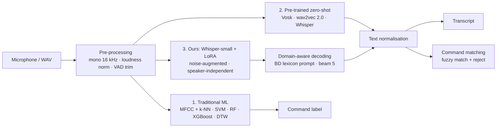

# 🎙️ TenVoices: Project Plan

> **Plan version 1.2 · 1 Oct 2026 · status: planning.** The work is planned week by week (see **🗓️ Development Roadmap**). Recording rules are in [DATA_COLLECTION_PROTOCOL.md](DATA_COLLECTION_PROTOCOL.md).
> Items marked *(confirm at kick-off)* are defaults the team confirms at the first meeting (see **❓ Decisions to Confirm at Kick-off**).

---

## 📌 At a Glance

| | |
|---|---|
| **Brief** | *Create a speech recognition system. Gather a dataset consisting of speech samples from 10 speakers uttering diverse phrases or sentences. Showcase the effectiveness of your method using this dataset.* |
| **System** | Speech-to-text pipeline: pre-processing + VAD → Whisper with noise-augmented LoRA fine-tuning and domain-aware decoding → text normalisation. Also has a voice-command mode. |
| **Comparison** | Traditional ML (MFCC + k-NN / SVM / Random Forest / XGBoost, and DTW) vs pre-trained deep models (Vosk, wav2vec 2.0, Whisper) vs our adapted Whisper |
| **Dataset** | **TenVoices v1**, recorded by us with consent: 10 speakers × 120 recordings ≈ **1,200 utterances (~70 min)** |
| **Effectiveness** | Leave-2-speakers-out 5-fold cross-validation. The headline WER is on **unseen speakers + unseen sentences**, with 95% CIs and significance tests. |
| **Team** | Tanvir Ahmed (lead) and Md. Shahriar Rakib Rabbi, plus 2 open member slots. Work is handed over through Claude Code (`CLAUDE.md`, `docs/STATUS.md`). |
| **Timeline** | 6 weeks, planned week by week |
| **Deliverables** | Open GitHub repo, dataset release + datasheet, CLI + demo app, individual update reports, IEEE-format report, slides, 1-minute demo video, poster |

---

## 📖 The Brief and Our Interpretation

| Requirement in the brief | What we deliver | How it can be checked |
|---|---|---|
| "Create a speech recognition system" | Speech → text system with a CLI (`main.py`) and a live Gradio demo (`app.py`) | Run the demo and speak into it |
| "Gather a dataset … from 10 speakers uttering diverse phrases or sentences" | **TenVoices v1**: 7 prompt types, 300 unique sentences, spontaneous answers, real-noise takes | `data/` metadata, datasheet, released audio |
| "Showcase the effectiveness of your method using this dataset" | Speaker-independent comparison with traditional and deep-learning baselines, plus statistics, robustness tests and error analysis | Tables and figures regenerated from `outputs/*.csv` |

**Interpretation**
- **Speech recognition** means turning speech into text with an open vocabulary, since the brief asks for "diverse phrases or sentences".
- We add a closed-set **command recognition** task. It lets traditional machine-learning models compete on the same data, and it gives the demo a practical use.
- **Effectiveness** must hold for **voices the system has never heard** and **sentences it has never seen**. Otherwise a fine-tuned model can look good just by memorising.

---

## 🎯 Objectives, Research Questions and Hypotheses

**Objectives**
- **O1** Build TenVoices v1 (10 speakers, ~1,200 utterances) with consent, metadata and quality control.
- **O2** Build a working speech recognition system (CLI + demo app).
- **O3** Compare traditional ML, pre-trained deep models and our approach on unseen speakers.
- **O4** Release code, data (from consenting speakers) and results openly and reproducibly.

**Research questions**
- **RQ1** How well do traditional MFCC-based models recognise commands from unseen speakers?
- **RQ2** How accurately do pre-trained recognisers transcribe Bangladeshi-accented English from unseen speakers?
- **RQ3** Does our adaptation (VAD + domain-aware decoding + noise-augmented LoRA) reduce errors on unseen speakers *and* unseen sentences?
- **RQ4** Which speakers, prompt types (numbers, names, commands, spontaneous speech) and noise levels still cause errors?

**Hypotheses.** These are frozen in `docs/ANALYSIS_PLAN.md` at the end of Week 2, before the main experiments, and reported whether or not they hold.

| ID | Hypothesis | Pass criterion |
|---|---|---|
| H1 | Our approach beats the best zero-shot model on unseen-speaker / unseen-text utterances | ≥ 15% relative WER reduction, and the paired-bootstrap 95% CI of the difference excludes 0 |
| H2 | Domain-aware decoding fixes Bangladeshi names and places | Named-entity word accuracy improves by ≥ 20 points over the same model without it |
| H3 | ASR-based command recognition generalises to new voices better than MFCC classifiers | ≥ 95% command accuracy on unseen speakers, above every traditional model |
| H4 | Noise-augmented fine-tuning degrades more gracefully | Lower WER than zero-shot at 5 dB and 0 dB SNR |

---

## 📦 Scope (MoSCoW)

- **Must:**
  - Dataset: 10 speakers, ≥ 100 utterances each, with consent, QC and metadata
  - Pre-processing and MFCC features
  - k-NN, SVM, Random Forest and XGBoost command baselines
  - Whisper and wav2vec 2.0 zero-shot runs
  - WER / CER metrics
  - The 5-fold speaker-independent protocol
  - Our approach (at minimum VAD + domain-aware decoding)
  - Per-speaker and per-category results
  - CLI + Gradio demo, README, report, slides, video, poster
- **Should:** LoRA fine-tuning with noise augmentation, DTW baseline, Vosk baseline, noise sweep, significance tests, GitHub Actions unit tests.
- **Could:** Whisper large-v3-turbo as an upper bound, a small Bangla extension (10 sentences per speaker), a speaker-identification side study, a Hugging Face Space demo, streaming transcription.
- **Won't (this semester):** training an ASR model from scratch, more than 10 speakers, a non-English main task.

---

## 📊 Dataset Plan: TenVoices v1

Full rules: [DATA_COLLECTION_PROTOCOL.md](DATA_COLLECTION_PROTOCOL.md) · Draft prompts: [`data/prompts/prompts_v0.csv`](../data/prompts/prompts_v0.csv)

**Speakers:**
- S01 and S02 are team members (M1, M2); S03–S10 are volunteers. Members who join later can take volunteer places.
- Target: 5 female / 5 male (self-reported), adults (18+), from a mix of home divisions.
- Everyone reads English with their natural Bangladeshi accent *(language: confirm at kick-off)*.

**Per speaker: 120 recordings in one 30–35 min session**

| Block | Code | Prompts | Recordings | Text group | Why |
|---|---|---|---|---|---|
| Voice commands | CMD | 15 shared | 30 (2 repetitions) | A | Command task for traditional ML and DTW |
| Numbers, times, money | NUM | 10 shared | 10 | 5 A / 5 B | Digits and number normalisation |
| Phonetically rich (Harvard sentences) | PHO | 15 shared | 15 | 8 A / 7 B | Phonetic coverage |
| Everyday sentences & questions | EVQ | 10 shared | 10 | 5 A / 5 B | Conversational read speech |
| Bangladeshi names & places | NER | 10 shared | 10 | 5 A / 5 B | Out-of-vocabulary entities |
| Unique sentences | UNQ | 30 per speaker (300 distinct) | 30 | U | Lexical diversity; never repeated across speakers |
| Spontaneous answers | SPN | 5 topics | 5 | S | Unscripted speech |
| Real-noise re-recordings | (flagged prompts) | 10 | 10 | test only | Real-world robustness |
| **Total** | | | **120** (× 10 = **1,200**) | | |

**Text groups:**
- **A**: may be used for training.
- **B**: held-out text, never trained on.
- **U**: unique to one speaker, so automatically unseen whenever that speaker is tested.
- **S**: spontaneous answers, test only.

---

## 🧠 Methodology

### 1. Traditional Machine Learning (Baseline)
- **Task:** closed-set recognition of the 15 voice commands (30 recordings per speaker).
- **Features:** MFCC (13) + Δ + ΔΔ with mean/variance normalisation, summarised by mean and standard deviation over three equal time segments (a fixed-length vector that keeps rough word order).
- **Models** (owner: M2): k-NN, SVM (RBF kernel), Random Forest, XGBoost, and DTW 1-nearest-neighbour on the full MFCC sequences.

- **Tuning and scoring:** hyper-parameters are tuned on the dev speaker. Reported as accuracy, macro F1 and a confusion matrix, speaker-independent. A speaker-dependent check (repetition 1 vs repetition 2 of the same speaker) shows how much accuracy depends on knowing the voice.

### 2. Pre-trained Deep Learning Models (Zero-Shot)
- Vosk small en-US (Kaldi hybrid HMM-DNN + n-gram LM).
- `facebook/wav2vec2-base-960h` (greedy CTC).
- Whisper tiny / base / small (encoder–decoder transformer).
- All engines share one interface, `transcribe(waveform, sr) -> str`, so they are scored by the same code.
- **Command task:** the transcript is fuzzy-matched to the 15 commands (`rapidfuzz`), with a rejection threshold tuned on dev speakers.

### 3. Our Approach: Adapted Whisper (Fine-Tuning)

| Component | Plan |
|---|---|
| Pre-processing | Mono 16 kHz, loudness normalisation (−23 LUFS), Silero VAD trim with 150 ms padding |
| Architecture | Whisper-small + LoRA (PEFT, rank 32 on the attention projections, ≈ 1–2% of the weights trainable, adapter ≈ 15 MB) |
| Training | 7 train speakers per fold, early stopping on 1 dev speaker; AdamW, learning rate tuned on the dev speaker; up to 5 epochs; batch 8 |
| Augmentation | Real noise bank + white noise at 5–20 dB SNR, speed 0.9–1.1×, gain ±6 dB, applied on the fly |
| Domain-aware decoding | Beam 5, temperature 0, English only; prompt with a fixed lexicon of Bangladeshi districts, places and names (`configs/lexicon_bd.txt`), built from public lists **before** any test decoding |
| Text normalisation | Whisper's English normaliser, applied identically to references and hypotheses |
| Hardware | Colab T4 GPU or Apple MPS for training; laptop CPU for the speed benchmark |

**Why Whisper + LoRA:**
- Whisper is pre-trained on 680,000 hours of labelled speech, so it recognises open-vocabulary English well out of the box.
- LoRA trains so few weights that ~580 training utterances per fold are enough, overfitting stays limited, and training fits a free Colab GPU.
- If fine-tuning does not help, the VAD front-end and domain-aware decoding still form a testable method (see risks).

---

## 🧪 Experiments

| ID | Question | Setup | Metrics | Owner | Week | Priority |
|---|---|---|---|---|---|---|
| E0 | What did we collect? | Statistics per speaker / category / condition | Minutes, counts, durations, SNR | M2 | 2 | Must |
| E1 | How good is traditional ML? | k-NN, SVM, RF, XGBoost, DTW on the 15 commands; speaker-independent folds + speaker-dependent check | Accuracy, macro F1, confusion matrix | M2 | 3 | Must |
| E2 | How good are pre-trained recognisers? | Vosk, wav2vec 2.0, Whisper tiny/base/small, zero-shot | WER, CER, SER, command accuracy, RTF | M1 → M3 | 3 | Must |
| E3 | Does our approach help? | Whisper-small + VAD + domain decoding + LoRA, 5 folds | Same metrics + ΔWER vs best baseline | M1 | 4 | Must |
| E4 | Which parts matter? | Ablations: −VAD, −prompt, −LoRA, −augmentation; tiny vs base vs small | WER | M1 + M3 | 4–5 | Should |
| E5 | Noise robustness | Test sets + held-out noise at 20/10/5/0 dB, plus the real-noise subset | WER vs SNR | M3 (noise bank: M2) | 5 | Should |
| E6 | Where are the errors? | Per speaker, per category, named-entity accuracy, substitution/deletion/insertion breakdown, top confusions | Tables + examples | M3 | 5 | Must |
| E7 | Is it practical? | Real-time factor and latency on laptop CPU vs GPU; model and adapter size | RTF, ms, MB | M1 | 5 | Should |

---

## 📏 Evaluation Protocol (frozen at the end of Week 2)

- **Folds.** 5 folds, each with 2 test speakers (one female and one male where possible), 1 dev speaker and 7 train speakers. Generated once by `tools/make_splits.py` (seed 42) and saved in `data/splits/folds.json`. Every speaker is a test speaker exactly once.
- **Reported subsets:**
  - **USUT** (unseen speaker + unseen text) = test speakers' B + U + S utterances. **This is the headline number.**
  - **USST** (unseen speaker, seen text) = test speakers' A utterances.
  - **COMMANDS**: test speakers' 30 command recordings (traditional ML vs ASR + matching).
  - **NOISY-REAL**: the real-noise recordings.
  - **NOISY-SYN**: test sets with added noise.
- **Training data per fold:**
  - Train speakers' A + U clean recordings, ≈ 580 utterances.
  - B and S text never appears in training.
  - The dev speaker is used for early stopping and **all** tuning (hyper-parameters, beam size, thresholds).
  - Test speakers are used only for final scoring.
- **Zero-shot models** are scored on exactly the same fold test sets, so all numbers are comparable.
- **Metrics:**
  - **WER** (primary; total word errors / total reference words), CER, sentence error rate.
  - Named-entity word accuracy.
  - Command accuracy and macro F1.
  - Real-time factor (processing time / audio duration).
- **Statistics:**
  - Paired bootstrap over utterances (10,000 resamples) for the 95% CI of ΔWER.
  - Wilcoxon signed-rank test over the 10 per-speaker WERs.
  - Mean ± std across folds.
- **Leakage guards (unit-tested):**
  - No speaker appears in more than one of {train, dev, test} within a fold.
  - No B/S text appears in training.
  - Noise clips used for training are disjoint from those used for testing.

---

## ✅ Quality Rules

- **Own data first:** every reported result is measured on TenVoices.
- **Full utterances:** audio is never truncated to a fixed length; utterances are short by design (2–8 s).
- **No single random split:** speaker-independent cross-validation with held-out text, confidence intervals and significance tests.
- **Balanced design:** every speaker records the same prompt blocks, so no speaker or class dominates.
- **One shared module per function:** no personal copies of scripts. Settings live in `configs/`; paths are relative; scripts take CLI arguments.
- **One source of truth for numbers:** every number in the README, report, slides and poster is generated from `outputs/`. README commands are tested on a clean clone before submission.
- **Repository hygiene:** no audio, models or large media in git; they are released as assets.
- **Use the GPU:** train on Colab or Apple MPS; use the CPU only for the speed benchmark.
- **Decide before measuring:** the analysis plan and hypotheses are frozen before the main experiments.

---

## 👥 Team, Roles and File Ownership

Member names are listed in `CLAUDE.md`, `README.md` and `docs/STATUS.md`. The rest of the docs refer to **slots** (M1–M4), so a member who joins later can take a slot without other edits. Right now **Tanvir Ahmed** holds M1, M3 and M4, and **Md. Shahriar Rakib Rabbi** holds M2.

| Slot | Workstream | Owns (planned files) |
|---|---|---|
| **M1** (lead) | Setup, data pipeline, ASR models and our approach, integration | `main.py`, `support/config.py`, `support/audio.py`, `support/dataset.py`, `support/asr.py`, `support/decoding.py`, `support/finetune.py`, `tools/make_splits.py`, `configs/`, `notebooks/` |
| **M2** | Dataset collection and curation, traditional ML baselines, augmentation, dataset release | `tools/recorder.py`, `tools/qc_report.py`, `support/features.py`, `support/classical/`, `support/augment.py`, `data/` metadata and datasheet |
| **M3** *(open slot)* | Evaluation: metrics, experiments, statistics, error analysis | `support/metrics.py`, `support/commands.py`, `support/stats.py`, `support/experiments.py`, `docs/ANALYSIS_PLAN.md`, `results/tables/` |
| **M4** *(open slot)* | Demo app, figures, poster, slides, video | `app.py`, `support/visualization.py`, `poster/`, `images/`, slides and video in `others/` |

**Speakers and cross-checks**

| Slot | Records | Cross-checks the recordings of |
|---|---|---|
| M1 | S01 (self) + volunteers S03–S06 | S02, S07–S10 |
| M2 | S02 (self) + volunteers S07–S10 | S01, S03–S06 |

- Each recruiting member also names one backup volunteer.
- A member who joins later can record themselves in place of a volunteer.
- Recruit so the full set of 10 reaches the 5F/5M target; gender is always self-reported on the consent form.

---

## 🔀 Team Workflow (relay with Claude Code)

Members work one after another, each through Claude Code. The repository tells Claude everything it needs:

- **`CLAUDE.md`** is loaded automatically by Claude Code. It holds the project summary, the team slots and the session rules.
- **`docs/STATUS.md`** is the task board (owner, dependencies, status) plus a handoff log.

A typical relay:
1. **Member A** pulls, asks Claude *"What is completed?"*, then *"Complete my next tasks."*
2. **Claude** only starts tasks whose dependencies are ✅. At the end of the session it runs the tests, updates `docs/STATUS.md`, commits and pushes.
3. **Member B** pulls and asks the same question. If the work B depends on is done, Claude completes B's tasks. If not, Claude says which task is still blocking.

Rules:
- **Branching:** work directly on `main`; pull before starting and before pushing.
- **Commits:** one task per commit, message `T07: 
`, with the member's own git identity.
- **Data:** audio is shared through the private team Drive, never through git. Small result tables go in `results/` and are committed so the next member can continue.
- **Definition of done:**
  - The task's *done when* condition is met and the tests pass.
  - Code is config-driven, uses relative paths and has docstrings.
  - No audio, models or personal data committed.
  - `docs/STATUS.md` is updated.

---

## 🗓️ Development Roadmap

- Week 1: Planning, repository setup, recording tool and pilot recordings.
- Week 2: Dataset collection from 10 speakers, quality control and transcripts.
- Week 3: Pre-processing, MFCC features, traditional ML baselines and zero-shot ASR.
- Week 4: Our approach: domain-aware decoding, noise augmentation and LoRA fine-tuning.
- Week 5: Speaker-independent experiments, noise robustness, error analysis and demo app.
- Week 6: Demo video, report, slides, poster and final polish.

The tasks for each week (T01–T28), with owners and dependencies, are in [STATUS.md](STATUS.md). If the instructor's deadlines differ, stretch or compress the weeks; the order of the work stays the same.

---

## 📝 Deliverables and Reporting

- **Individual update report** (if the course requires it): 2 pages, weekly-log format (template: [templates/individual_update_report.md](templates/individual_update_report.md)), written from the member's entries in the STATUS.md handoff log.
- **Final report:** 8-page IEEE double-column LaTeX (`others/final_report.tex`, compiled with `tectonic`):

| Section | Owner |
|---|---|
| Abstract, I. Introduction | M1 |
| II. Background & related work (MFCC + classical ML, DTW, CTC and encoder–decoder ASR, LoRA) | M1 |
| III. The TenVoices dataset (collection, statistics, ethics) | M2 |
| IV. Methodology (traditional ML: M2; zero-shot models and our approach: M1) | M1 + M2 |
| V. Implementation | M1 |
| VI. Experimental evaluation (setup, results, discussion, threats to validity) | M3 |
| VII. Limitations, ethics & future work | M2 |
| VIII. Conclusion | M3 |

- **Slides, results poster and 1-minute demo video:** M4.
- **README** with final results, figures and a working how-to-run: M1.

---

## 💻 Compute and Environment

- Python 3.11 (3.10–3.12 works) and PyTorch: CUDA on Colab T4, MPS on Apple Silicon, CPU fallback.
- Traditional ML models (scikit-learn, XGBoost) train in seconds on any laptop.
- Long runs live in `notebooks/` so any member can run them on Colab. Folds can run in parallel on different members' accounts using the same config.
- One Whisper-small LoRA fold should take minutes on a T4. Whisper-base is the fallback if compute is tight.
- LoRA adapters and checkpoints are stored in the shared Drive and as release assets, **never in git**.

---

## ⚠️ Risks and Mitigations

| Risk | Likelihood | Impact | Mitigation | Owner |
|---|---|---|---|---|
| Volunteers cancel or run late | Medium | High | Book sessions in Week 1, keep 2 backups, allow remote sessions with the recorder on the volunteer's laptop | M2 |
| Inconsistent audio quality | Medium | Medium | Pilot sessions in Week 1, written protocol, QC script, re-records in Week 2 | M2 |
| Some speakers decline public release | Medium | Medium | Opt-in consent; release audio only for consenting speakers; publish metrics for everyone | M2 |
| No GPU / slow training | Medium | Medium | LoRA, Whisper-base fallback, free Colab GPU | M1 |
| Fine-tuning doesn't help or overfits | Medium | Medium | Early stopping on the dev speaker; VAD + prompt still form a method; H1 is falsifiable, so a negative result is reported honestly | M1 |
| Traditional models score near chance | Medium | Low | Expected on unseen speakers; report the speaker-dependent check too, since that contrast is itself a finding | M2 |
| Normalisation artefacts inflate WER | Medium | Medium | Written conventions + tests (Week 1); manual review of 50 errors | M3 |
| Data leakage between train and test | Low | High | Split rules + unit tests | M1, M3 |
| A member is unavailable and a handoff stalls | Medium | Medium | Every task is written up in STATUS.md, so the lead (or a new member) can take it over; small tasks, frequent pushes | M1 |
| Merge conflicts | Low | Medium | Sequential relay; pull before working; one task per commit | All |
| Scope creep | Medium | Medium | MoSCoW list; feature freeze at the end of Week 5 | All |
| Real deadlines differ from this plan | Medium | Medium | Stretch or compress the weeks; the order of work stays valid | All |

---

## 🔒 Ethics, Privacy and Licensing

- **Consent:** written consent from all 10 speakers ([consent_form.md](consent_form.md)). Public release is a separate opt-in. Speakers can withdraw until the release date.
- **Pseudonymity:** speakers are identified only as S01–S10. Metadata is limited to gender, age band, home division, first language and device; no names, phone numbers or student IDs. Spontaneous answers must not contain personal details.
- **Storage:** raw audio and signed forms stay in a private shared Drive during collection. Nothing personal goes into git.
- **Licences:**
  - Code: MIT.
  - TenVoices audio and transcripts: CC BY 4.0 (consenting speakers only).
  - Prompt text: Harvard sentences (IEEE 1969 Recommended Practice) and Mozilla Common Voice sentences (CC0), both credited in the datasheet.

---

## ❓ Decisions to Confirm at Kick-off

1. Names for the open member slots (M3, M4) if new members join. Update the team tables in `CLAUDE.md`, `README.md` and `docs/STATUS.md`.
2. Course code, section, group number, instructor and deadlines. Update the README table and the roadmap if needed.
3. Language: English read with a Bangladeshi accent (**recommended**), Bangla, or English plus a small Bangla extension.
4. Public dataset release for consenting speakers (**recommended: yes**).
5. Model size for our approach: Whisper-small (default) or Whisper-base if compute is tight.

---

## 📚 References

1. A. Radford et al., "Robust Speech Recognition via Large-Scale Weak Supervision," *ICML*, 2023. (Whisper)
2. A. Baevski, H. Zhou, A. Mohamed and M. Auli, "wav2vec 2.0: A Framework for Self-Supervised Learning of Speech Representations," *NeurIPS*, 2020.
3. E. J. Hu et al., "LoRA: Low-Rank Adaptation of Large Language Models," *ICLR*, 2022.
4. H. Sakoe and S. Chiba, "Dynamic Programming Algorithm Optimization for Spoken Word Recognition," *IEEE Trans. ASSP*, 1978.
5. S. Davis and P. Mermelstein, "Comparison of Parametric Representations for Monosyllabic Word Recognition in Continuously Spoken Sentences," *IEEE Trans. ASSP*, 1980.
6. T. Cover and P. Hart, "Nearest Neighbor Pattern Classification," *IEEE Trans. Information Theory*, 1967.
7. C. Cortes and V. Vapnik, "Support-Vector Networks," *Machine Learning*, 1995.
8. L. Breiman, "Random Forests," *Machine Learning*, 2001.
9. T. Chen and C. Guestrin, "XGBoost: A Scalable Tree Boosting System," *KDD*, 2016.
10. D. Povey et al., "The Kaldi Speech Recognition Toolkit," *IEEE ASRU*, 2011.
11. A. Graves et al., "Connectionist Temporal Classification," *ICML*, 2006.
12. R. Ardila et al., "Common Voice: A Massively-Multilingual Speech Corpus," *LREC*, 2020.
13. IEEE Subcommittee on Subjective Measurements, "IEEE Recommended Practice for Speech Quality Measurements," *IEEE Trans. Audio and Electroacoustics*, 1969. (Harvard sentences)
14. T. Gebru et al., "Datasheets for Datasets," *Communications of the ACM*, 2021.
