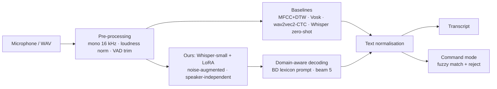

# TenVoices: Full Project Plan

> **Plan version 1.0 · written 1 Oct 2026 · status: planning.** Implementation starts on **Day 1 (Sat 3 Oct 2026)**.
> Day-by-day tasks are in [DAILY_PLAN.md](DAILY_PLAN.md) and recording rules are in [DATA_COLLECTION_PROTOCOL.md](DATA_COLLECTION_PROTOCOL.md).
> Items marked *(confirm Day 1)* are defaults the team must confirm at the kick-off meeting (see §16).

---

## 0. At a glance

| | |
|---|---|
| **Brief** | *Create a speech recognition system. Gather a dataset consisting of speech samples from 10 speakers uttering diverse phrases or sentences. Showcase the effectiveness of your method using this dataset.* |
| **Our system** | A speech-to-text (ASR) pipeline: 16 kHz pre-processing + VAD → Whisper with noise-augmented LoRA adaptation and domain-aware decoding → text normalisation. It also has a closed-set **command mode**. |
| **Our dataset** | **TenVoices v1**: 10 speakers × 120 recordings ≈ **1,200 utterances (~70 min)** across 7 prompt types (incl. spontaneous speech), in clean and real-noise conditions, collected with written consent |
| **Effectiveness** | Speaker-independent **5-fold cross-validation** (2 unseen speakers per fold). The headline WER is on **unseen speakers + unseen sentences**, compared against 4 baseline families, with 95% CIs and significance tests. |
| **Team** | 4 members, one module and one Git branch each (same workflow as our Group 5 MDP project) |
| **Timeline** | 6 weeks / 42 days: **Sat 3 Oct → Fri 13 Nov 2026**, with Fridays as buffer days *(shift dates if deadlines differ)* |
| **Deliverables** | Open GitHub repo, dataset release + datasheet, CLI + demo app, individual update reports, 8-page IEEE report, slides, 1-minute demo video, poster |

---

## 1. The brief and how we read it

| Requirement in the brief | What we deliver | How a grader can check it |
|---|---|---|
| "Create a speech recognition system" | Speech → text system with a CLI (`main.py`) and a live Gradio demo (`app.py`) | Run the demo and speak into it |
| "Gather a dataset … from 10 speakers uttering diverse phrases or sentences" | **TenVoices v1**, recorded by us: 7 prompt categories, 300 unique sentences, spontaneous answers, real-noise takes | `data/` metadata, datasheet, released audio |
| "Showcase the effectiveness of your method using this dataset" | Speaker-independent evaluation against classical and modern baselines, with statistics, robustness tests and error analysis | Tables/figures regenerated from `outputs/*.csv` |

**Interpretation.**
- *Speech recognition* means automatic speech recognition: turning speech into text, with an open vocabulary (the brief says "diverse phrases or sentences"). It does **not** mean accent or speaker classification.
- We add a closed-set **command task** for two reasons. It lets us include a classical recogniser (MFCC + DTW), and it gives the demo a practical use case.
- *Effectiveness* must be measured on **voices the system has never heard** and **sentences it has never seen**. Without that, a fine-tuned model can look good just by memorising.

---

## 2. Lessons from the two previous projects

### 2.1 Our Group 5 project: Autonomous Volcanic Terrain Exploration (MDP)

**Keep:**
- **Code layout and ownership.** `main.py` + `support/` package, one owner per file, one branch per member, rebase on `main` before merging. Nobody edits a file they don't own; integration happens through public interfaces (in Group 5, the baselines subclassed the agent).
- **Reproducibility.** A config file with validation, seeded deterministic runs (repeat runs gave byte-identical results), and `unittest` tests that need no extra dependencies.
- **Fair comparison.** The proposed method and simple baselines run in the same environment and are scored with the same metrics. Group 5 compared MDP vs greedy vs random over 20 seeds; here it is our pipeline vs DTW, Vosk, wav2vec2 and Whisper on the same folds.
- **README.** Poster at the top, figures, how-to-run, tests, limitations, roadmap. `images/` holds committed figures, `outputs/` is gitignored, and `others/` holds reports, slides and video.
- **Deliverable set.** Individual update reports (weekly-log format), an 8-page IEEE LaTeX report compiled with `tectonic`, slides, voice-over script, one-minute demo video, poster.

**Improve:**
- **Fix the evaluation design before writing code.** In the MDP project the science-"camping" flaw only showed up during experiments and was patched at experiment level. Here, split rules, metrics and hypotheses are frozen on **Day 13**, before the main runs.
- **Report uncertainty** (confidence intervals, significance tests), not only averages.

### 2.2 Group 6: Speech Accent Recognition (same topic area)

**What they did:** accent-region classification (9 classes) on the public *Speech Accent Archive*. They compared MFCC + kNN/SVM/RF/XGBoost (best 29.4%) against fine-tuned wav2vec2 / w2v-BERT (48–52%), using Gaussian-noise augmentation.

| Group 6 issue | Our fix |
|---|---|
| No dataset gathered by the team; accent classification instead of speech recognition | We record TenVoices ourselves, build speech-to-text, and evaluate on our own data |
| Audio cut to the first 4–5 s (`max_length=16000*4`) of a ~25 s passage | Short utterances by design (2–8 s), processed at full length |
| One random 80/20 split, no confidence intervals | Leave-2-speakers-out 5-fold CV, sentence-disjoint test text, bootstrap CIs, Wilcoxon tests |
| Class imbalance noted but not handled | Balanced design: same prompts for every speaker, 5F/5M target, fixed counts per category |
| One copy of the same script per person (`ahmad_fahmid_*`, `fahim_*`, `shefa_*`) and hard-coded `C:\Users\...` paths | One shared module per function, config file, relative paths, CLI arguments |
| README points to scripts that don't exist and a placeholder clone URL; README and paper report different headline numbers (48.13% vs 52.1%) | README commands tested on a clean clone (Day 38); every number generated from `outputs/` |
| GPU disabled, slow CPU-only training | LoRA on Colab GPU / Apple MPS; CPU only for inference benchmarks |
| ~70 MB of video committed to git | Audio and models never go into git; they are released as assets |

**Reuse:** noise augmentation (now with real recorded noise and SNR control), the classical-vs-pretrained comparison, and per-class analysis. Group 6's contributor list includes **Fahim Foysal** (fine-tuning) and **Shefa Tabassum** (noise augmentation), so their experience maps directly onto their roles here.

---

## 3. Objectives, research questions and hypotheses

**Objectives**
- **O1** Build TenVoices v1 (10 speakers, ~1,200 utterances) with consent, metadata and quality control.
- **O2** Build a working speech recognition system (CLI + demo app).
- **O3** Measure its effectiveness against classical and modern baselines using a speaker-independent protocol.
- **O4** Release code, data (from consenting speakers) and results openly and reproducibly.

**Research questions**
- **RQ1** How accurately do classical and modern off-the-shelf recognisers transcribe Bangladeshi-accented English from unseen speakers?
- **RQ2** Does our adaptation (VAD front-end + domain-aware decoding + noise-augmented LoRA fine-tuning) reduce errors on unseen speakers *and* unseen sentences?
- **RQ3** Where do errors remain: which speakers, which prompt types (numbers, names, commands, spontaneous speech), and which noise levels?

**Hypotheses.** These are frozen on Day 13 in `docs/ANALYSIS_PLAN.md`, before the main runs, and reported whether or not they hold.

| ID | Hypothesis | Pass criterion |
|---|---|---|
| H1 | Our pipeline beats the best zero-shot baseline on unseen-speaker / unseen-text utterances | ≥ 15% relative WER reduction, and the paired-bootstrap 95% CI of the difference excludes 0 |
| H2 | Domain-aware decoding fixes Bangladeshi names and places | Named-entity word accuracy improves by ≥ 20 points over the same model without it |
| H3 | Template matching does not generalise across speakers; ASR-based command recognition does | DTW accuracy drops ≥ 20 points from speaker-dependent to speaker-independent, while ASR + matching reaches ≥ 95% speaker-independent |
| H4 | Noise-augmented adaptation degrades more gracefully | Lower WER than zero-shot at 5 dB and 0 dB SNR |

---

## 4. Scope (MoSCoW)

- **Must:**
  - Dataset: 10 speakers, ≥ 100 utterances each, with consent, QC and metadata
  - Pre-processing
  - Whisper and wav2vec2 zero-shot baselines
  - WER / CER / SER metrics
  - The 5-fold speaker-independent protocol
  - Our adapted pipeline (at minimum VAD + domain-aware decoding)
  - Per-speaker and per-category results
  - CLI + Gradio demo
  - README, report, slides, video, poster
- **Should:** LoRA fine-tuning with noise augmentation, MFCC+DTW command baseline, Vosk (Kaldi) baseline, noise sweep, significance tests, GitHub Actions unit tests.
- **Could:** Whisper large-v3-turbo as an upper bound, a Bangla mini-extension (10 sentences per speaker), a speaker-identification side study, a Hugging Face Space demo, streaming transcription.
- **Won't (this semester):** training an ASR model from scratch, more than 10 speakers, a non-English main task.

---

## 5. Dataset design: TenVoices v1

Full rules are in [DATA_COLLECTION_PROTOCOL.md](DATA_COLLECTION_PROTOCOL.md); the draft prompts are in [`data/prompts/prompts_v0.csv`](../data/prompts/prompts_v0.csv).

**Speakers:**
- S01–S04 are team members; S05–S10 are volunteers.
- Target: 5 female / 5 male (self-reported), adults (18+), from a mix of home divisions.
- Everyone reads English naturally, i.e. Bangladeshi-accented English *(language: confirm Day 1)*.

**Per speaker: 120 recordings in one 30–35 min session**

| Block | Code | Prompts | Recordings | Text group | Why |
|---|---|---|---|---|---|
| Voice commands | CMD | 15 shared | 30 (2 repetitions) | A | Closed-set task; repetitions allow a speaker-dependent DTW test |
| Numbers, times, money | NUM | 10 shared | 10 | 5 A / 5 B | Digits and number normalisation |
| Phonetically rich (Harvard sentences) | PHO | 15 shared | 15 | 8 A / 7 B | Phonetic coverage |
| Everyday sentences & questions | EVQ | 10 shared | 10 | 5 A / 5 B | Conversational read speech |
| Bangladeshi names & places | NER | 10 shared | 10 | 5 A / 5 B | Out-of-vocabulary entities (a known ASR weakness) |
| Unique sentences | UNQ | 30 per speaker (300 distinct) | 30 | U | Lexical diversity; no sentence repeated across speakers |
| Spontaneous answers | SPN | 5 topics | 5 | S | Unscripted speech |
| Real-noise re-recordings | (flagged prompts) | 10 | 10 | test only | Real-world robustness |
| **Total** | | | **120** (× 10 = **1,200**) | | |

**Text groups.** These keep test sentences out of training:
- **A**: may be used for training.
- **B**: held-out text, never trained on.
- **U**: unique to one speaker, so automatically unseen whenever that speaker is a test speaker.
- **S**: spontaneous answers, test only.

---

## 6. System design

| # | Component | Plan | Owner |
|---|---|---|---|
| 1 | Pre-processing | Mono, resample to 16 kHz, loudness normalisation (−23 LUFS), Silero VAD trim with 150 ms padding | M1 |
| 2 | Common interface | Every engine implements `transcribe(waveform, sr) -> str`, so all systems are evaluated by the same code | M2 |
| 3a | Classical baseline | MFCC (13) + Δ + ΔΔ with CMVN, DTW 1-nearest-neighbour; closed-set commands only | M4 |
| 3b | Hybrid HMM-DNN baseline | Vosk small en-US model (Kaldi TDNN + n-gram LM) | M2 |
| 3c | Self-supervised CTC baseline | `facebook/wav2vec2-base-960h`, greedy CTC decoding | M2 |
| 3d | Encoder–decoder baseline | Whisper tiny / base / small, zero-shot | M2 |
| 4 | **Ours: adaptation** | Whisper-small + LoRA (PEFT, rank 32 on the attention projections, ≈ 1–2% of parameters, adapter ≈ 15 MB). Trained per fold on 7 speakers, early-stopped on 1 dev speaker. On-the-fly augmentation: real noise bank + white noise at 5–20 dB SNR, speed 0.9–1.1, gain ±6 dB. | M2 (augmentation: M3) |
| 5 | **Ours: domain-aware decoding** | Beam 5, temperature 0, language fixed to English. The decoder is prompted with a fixed lexicon of Bangladeshi places and names (`configs/lexicon_bd.txt`), built from public lists of districts, Dhaka areas and universities **before** any test decoding. | M2 |
| 6 | Text normalisation | Whisper's English normaliser applied identically to references and hypotheses (numbers, contractions, punctuation, case) | M4 |
| 7 | Command mode | Fuzzy-match the transcript to the 15 commands (`rapidfuzz`), rejecting matches below a threshold tuned on dev speakers | M4 |
| 8 | Interfaces | `main.py` CLI (transcribe / evaluate / reproduce) and `app.py` Gradio demo (microphone → transcript, model switch, command mode) | M1, M3 |

**Why Whisper + LoRA:**
- Whisper has strong zero-shot accuracy, and its large multilingual training data covers accent variety.
- LoRA trains only ~1–2% of the weights. That fits a free Colab T4 or Apple MPS, keeps adapters small enough to share, and limits overfitting with only ~580 training utterances per fold.
- If LoRA does not help, the VAD front-end and domain-aware decoding still form a testable method (see risks, §14).

---

## 7. Experiments

| ID | Question | Setup | Metrics | Owner | Week | Priority |
|---|---|---|---|---|---|---|
| E0 | What did we collect? | Statistics per speaker / category / condition | Minutes, counts, durations, SNR | M1 + M3 | 2 | Must |
| E1 | How good is a classical recogniser? | MFCC + DTW: speaker-dependent (rep 1 ↔ rep 2) vs speaker-independent (folds) | Command accuracy, confusion matrix | M4 | 3 | Should |
| E2 | How good are off-the-shelf recognisers? | Vosk, wav2vec2, Whisper tiny/base/small, zero-shot | WER, CER, SER, RTF | M2 → M4 | 3 | Must |
| E3 | Does our method help? | Whisper-small + VAD + domain decoding + LoRA, 5 folds | Same metrics + ΔWER vs best baseline | M2 | 4 | Must |
| E4 | Which parts matter? | Ablations: −VAD, −prompt, −LoRA, −augmentation; tiny vs base vs small | WER | M2 + M4 | 4–5 | Should |
| E5 | Commands | DTW vs ASR + matching (zero-shot vs ours), clean vs noisy | Accuracy, rejection rate | M4 | 4 | Should |
| E6 | Noise robustness | Test sets + held-out noise at 20/10/5/0 dB, plus the real-noise subset | WER vs SNR curve | M3 + M4 | 5 | Should |
| E7 | Where are the errors? | Per speaker, per category, named-entity accuracy, substitution/deletion/insertion breakdown, top confusions, effect of length | Tables + examples | M4 (+ all) | 5 | Must |
| E8 | Is it practical? | Real-time factor and latency on laptop CPU vs GPU; model and adapter size | RTF, ms, MB | M2 | 5 | Should |

---

## 8. Evaluation protocol (frozen on Day 13)

- **Folds.** 5 folds, each with 2 test speakers (one female and one male where possible), 1 dev speaker and 7 train speakers. Generated once by `tools/make_splits.py` (seed 42) and frozen in `data/splits/folds.json` on Day 12. Every speaker is a test speaker exactly once.
- **Reported subsets:**
  - **USUT** (unseen speaker + unseen text) = test speakers' B + U + S utterances. **This is the headline number.**
  - **USST** (unseen speaker, seen text) = test speakers' A utterances. Secondary.
  - **NOISY-REAL**: the 10 real-noise recordings per speaker.
  - **NOISY-SYN**: test sets with added noise.
- **Training data per fold:**
  - Train speakers' A + U clean recordings, ≈ 580 utterances.
  - B and S text never appears in any training set.
  - Dev speaker's A + U data is used for early stopping and **all** tuning (beam size, thresholds, learning rate).
  - Test speakers are touched only for final scoring.
- **Zero-shot models** are scored on exactly the same fold test sets, so every number in every table is comparable.
- **Metrics:**
  - **WER** (primary; micro-averaged = total word errors / total reference words), CER, sentence error rate.
  - Named-entity word accuracy.
  - Command accuracy and rejection rate.
  - Real-time factor (RTF = processing time / audio duration) and latency per utterance.
- **Statistics:**
  - Paired bootstrap over utterances (10,000 resamples) for the 95% CI of ΔWER.
  - Wilcoxon signed-rank test over the 10 per-speaker WERs.
  - Mean ± std across folds.
- **Reproducibility:** fixed seeds, pinned versions, all settings in `configs/`, every table generated by a script from `outputs/*.csv`, and a SHA-256 manifest for the data.
- **Leakage guards (unit-tested):**
  - No speaker appears in more than one of {train, dev, test} within a fold.
  - No B/S text appears in any training set.
  - Noise clips used for training augmentation are disjoint from those used for noise testing.

---

## 9. Team, roles and file ownership

Default roles keep each person's Group 5 strengths *(confirm Day 1)*.

| Member | Role | Owns (planned files) | Also responsible for |
|---|---|---|---|
| **M1 · Shakil Ahmed** | Data & pipeline lead, integration | `main.py`, `support/config.py`, `support/audio.py`, `support/dataset.py`, `tools/make_splits.py`, `tools/qc_report.py`, `configs/config.yaml`, `data/` metadata | Repo admin, merges, CI, dataset release package |
| **M2 · Fahim Foysal** | ASR modelling lead | `support/asr.py`, `support/decoding.py`, `support/finetune.py`, `notebooks/`, `configs/lexicon_bd.txt` | Colab training runs, efficiency benchmark, slides |
| **M3 · Shefa Tabassum** | Data collection, augmentation & demo lead | `tools/recorder.py`, `support/augment.py`, `support/visualization.py`, `app.py`, `poster/`, `images/`, collection docs | Volunteer scheduling, noise bank, demo video, poster |
| **M4 · Tanvir Ahmed** | Evaluation & experiments lead | `support/metrics.py`, `support/features.py`, `support/dtw.py`, `support/commands.py`, `support/stats.py`, `support/experiments.py` | Analysis plan, results tables, report results section |

**Everyone** records themselves, recruits volunteers, checks another member's recordings, writes tests for their own code, keeps a daily log, and writes their own update report and report section.

| Recruiting member | Speakers | Cross-checks the recordings of |
|---|---|---|
| M1 Shakil | S01 (self), S05, S06 | S02, S07 (M2's speakers) |
| M2 Fahim | S02 (self), S07 | S01, S05, S06 (M1's speakers) |
| M3 Shefa | S03 (self), S08, S09 | S04, S10 (M4's speakers) |
| M4 Tanvir | S04 (self), S10 | S03, S08, S09 (M3's speakers) |

Each member also names one backup volunteer. Recruit so the full set of 10 reaches the 5F/5M target; gender is always self-reported on the consent form.

---

## 10. Team workflow

- **Branches:** `member1-data`, `member2-asr`, `member3-collection`, `member4-evaluation`. Rebase on `main` → pull request → 1 reviewer → merge. `main` is protected.
- **Commit prefixes:** `feat:`, `fix:`, `data:`, `exp:`, `docs:`, `test:`.
- **Daily stand-up** (async, group chat, 10 pm): *done today / next / blocked*. Anyone blocked for more than a day calls a 10-minute meeting.
- **Weekly meeting** (Saturday, 30 min): demo progress, merge the week's PRs, check the week's exit criteria, adjust the plan.
- **Daily log:** each member adds 2–3 lines to `docs/logs/<member>.md` every working day. These become the weekly log in the individual update report.
- **Tracking:** GitHub Project board with one issue per member per week, using the checklist from DAILY_PLAN. Only M1 edits `DAILY_PLAN.md` (at the weekly meeting), to avoid merge conflicts.
- **Definition of done:**
  - Runs from the repo root with relative paths, and is config-driven.
  - Has docstrings and unit tests where testable.
  - No audio, models or secrets committed.
  - README updated if the change is user-facing.
  - Reviewed by one teammate.

---

## 11. Timeline and milestones

| Week | Dates (2026) | Goal | Milestone |
|---|---|---|---|
| 1 | Sat 3 – Fri 9 Oct | Foundations, recorder, metrics, pilot sessions (S01–S04) | **M1 Ready to record** · Thu 8 Oct |
| 2 | Sat 10 – Fri 16 Oct | Record S05–S10, QC, transcripts, splits, freeze data | **M2 TenVoices v1 frozen** · Thu 15 Oct |
| 3 | Sat 17 – Fri 23 Oct | Zero-shot + DTW baselines, evaluation harness, Update 1 | **M3 Baselines + Update 1** · Thu 22 Oct |
| 4 | Sat 24 – Fri 30 Oct | Our method: VAD, domain decoding, augmentation, LoRA 5-fold | **M4 Method results** · Thu 29 Oct |
| 5 | Sat 31 Oct – Fri 6 Nov | Noise sweep, ablations, error analysis, demo; feature freeze Wed 4 Nov | **M5 Results frozen** · Thu 5 Nov |
| 6 | Sat 7 – Fri 13 Nov | Report, slides, video, results poster, dataset release | **M6 Final submission** · Thu 12 Nov |

If the instructor's real dates differ, shift the calendar. The order of the work stays the same.

---

## 12. Deliverables and reporting

- **Individual update report:** 2 pages, in the weekly-log format used in Group 5 (template: [templates/individual_update_report.md](templates/individual_update_report.md)). Planned for Day 20; if a second update is required, it reports the Day 34 state.
- **Final report:** 8-page IEEE double-column LaTeX (`others/final_report.tex`, compiled with `tectonic`), following the Group 5 structure:

| Section | Owner |
|---|---|
| Abstract, I. Introduction | M1 |
| II. Background & related work (DTW/HMM → CTC → encoder–decoder ASR, accent robustness, LoRA) | M2 |
| III. The TenVoices dataset (collection, statistics, ethics) | M3 |
| IV. Methodology (pipeline, adaptation, decoding) | M2 (front-end: M1) |
| V. Implementation & division of work | M1 |
| VI. Experimental evaluation (setup, results, discussion, threats to validity) | M4 |
| VII. Limitations, ethics & future work | M3 |
| VIII. Conclusion | M4 |

- **Slides** (12–15) and **rehearsals**: M2 leads, everyone presents their own part.
- **Voice-over script + 1-minute demo video**: M2 + M3.
- **Results poster**: replaces the planning poster on Day 36. M3 owns it.
- **README** with final results, figures and a working how-to-run: M1.

---

## 13. Compute and environment

- Python 3.11 (3.10–3.12 works) and PyTorch: CUDA on Colab T4, MPS on Apple Silicon, CPU fallback.
- Long runs live in `notebooks/` so any member can run them on Colab. Folds can run in parallel on different members' accounts using the same config.
- One Whisper-small LoRA fold (~580 utterances, a few epochs) should take minutes on a T4. Whisper-base is the fallback if compute is tight.
- LoRA adapters and checkpoints are stored in the shared Drive and as release assets, **never in git**.

---

## 14. Risks and mitigations

| Risk | Likelihood | Impact | Mitigation | Owner |
|---|---|---|---|---|
| Volunteers cancel or run late | Medium | High | Book sessions in Week 1, keep 2 backups, allow remote sessions with the recorder on the volunteer's laptop | M3 |
| Inconsistent audio quality | Medium | Medium | Pilot day, written protocol, QC script, re-record budget on Day 12 | M1 |
| Some speakers decline public release | Medium | Medium | Opt-in consent; release audio only for consenting speakers; publish metrics for everyone | M3 |
| No GPU / slow training | Medium | Medium | LoRA, Whisper-base fallback, Colab across 4 accounts | M2 |
| Fine-tuning doesn't help or overfits | Medium | Medium | Early stopping on the dev speaker; VAD + prompt still form a method; H1 is falsifiable, so a negative result is reported honestly | M2 |
| Normalisation artefacts inflate WER | Medium | Medium | Written conventions + tests (Day 3); manual review of 50 errors | M4 |
| Data leakage between train and test | Low | High | Split rules + unit tests | M1, M4 |
| Merge conflicts / uneven workload | Medium | Medium | File ownership, weekly merges, Friday buffer days | M1 |
| Scope creep | Medium | Medium | MoSCoW list; feature freeze on Day 33 | All |
| Real deadlines differ from this plan | Medium | Medium | Shift the calendar; the order of work stays valid | All |

---

## 15. Ethics, privacy and licensing

- **Consent:** written consent from all 10 speakers ([consent_form.md](consent_form.md)). Public release is a separate opt-in. Speakers can withdraw until the release date.
- **Pseudonymity:** speakers are identified only as S01–S10. Metadata is limited to gender, age band, home division, first language and device; no names, phone numbers or student IDs. Spontaneous answers must not include personal details.
- **Storage:** raw audio and signed forms stay in a private shared Drive during collection. Nothing personal goes into git.
- **Licences:**
  - Code: MIT.
  - TenVoices audio and transcripts: CC BY 4.0 (consenting speakers only).
  - Prompt text: Harvard sentences (IEEE 1969 Recommended Practice) and Mozilla Common Voice sentences (CC0), both credited in the datasheet.

---

## 16. Decisions to confirm at kick-off (Day 1)

1. Team composition and roles (defaults are taken from Group 5).
2. Course code, section, group number, instructor and real deadlines. Update the README table and the calendar.
3. Language: English read with a Bangladeshi accent (**recommended**), Bangla, or English plus a small Bangla extension.
4. Public dataset release for consenting speakers (**recommended: yes**).
5. Model size for "ours": Whisper-small (default) or Whisper-base if compute is tight.

---

## 17. Key references

1. A. Radford et al., "Robust Speech Recognition via Large-Scale Weak Supervision," *ICML*, 2023. (Whisper)
2. A. Baevski, H. Zhou, A. Mohamed and M. Auli, "wav2vec 2.0: A Framework for Self-Supervised Learning of Speech Representations," *NeurIPS*, 2020.
3. E. J. Hu et al., "LoRA: Low-Rank Adaptation of Large Language Models," *ICLR*, 2022.
4. H. Sakoe and S. Chiba, "Dynamic Programming Algorithm Optimization for Spoken Word Recognition," *IEEE Trans. ASSP*, 1978.
5. S. Davis and P. Mermelstein, "Comparison of Parametric Representations for Monosyllabic Word Recognition in Continuously Spoken Sentences," *IEEE Trans. ASSP*, 1980.
6. D. Povey et al., "The Kaldi Speech Recognition Toolkit," *IEEE ASRU*, 2011.
7. A. Graves et al., "Connectionist Temporal Classification," *ICML*, 2006.
8. D. S. Park et al., "SpecAugment: A Simple Data Augmentation Method for Automatic Speech Recognition," *Interspeech*, 2019.
9. R. Ardila et al., "Common Voice: A Massively-Multilingual Speech Corpus," *LREC*, 2020.
10. IEEE Subcommittee on Subjective Measurements, "IEEE Recommended Practice for Speech Quality Measurements," *IEEE Trans. Audio and Electroacoustics*, 1969. (Harvard sentences)
11. T. Gebru et al., "Datasheets for Datasets," *Communications of the ACM*, 2021.
12. Silero Team, "Silero VAD: pre-trained enterprise-grade Voice Activity Detector," GitHub, 2021.
