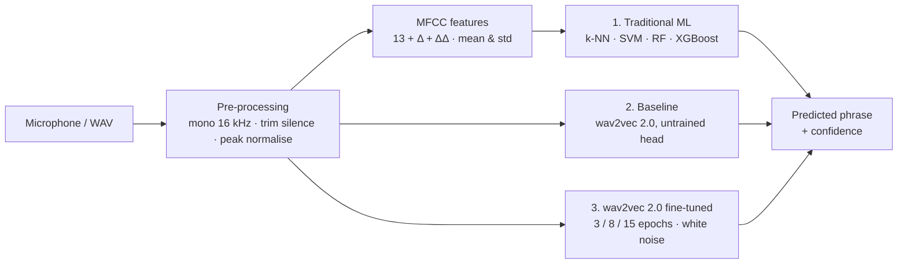

# 🎙️ TenVoices: Project Plan

> **Plan version 2.0 · 1 Oct 2026 · status: planning.** Tasks, owners and progress are in [STATUS.md](STATUS.md); recording rules are in [DATA_COLLECTION_PROTOCOL.md](DATA_COLLECTION_PROTOCOL.md).
> Items marked *(confirm at kick-off)* are defaults the team confirms at the first meeting (see **❓ Decisions to Confirm**).

---

## 📌 At a Glance

| | |
|---|---|
| **Brief** | *Create a speech recognition system. Gather a dataset consisting of speech samples from 10 speakers uttering diverse phrases or sentences. Showcase the effectiveness of your method using this dataset.* |
| **Task** | **Spoken phrase recognition:** given a recording, recognise which of **50 diverse phrases** was spoken |
| **Dataset** | **TenVoices v1**, recorded by us with consent: 10 speakers × 50 phrases × 3 repetitions + 10 real-noise takes each ≈ **1,600 clips (~1 hour)** |
| **Methods** | Traditional ML (MFCC + k-NN / SVM / Random Forest / XGBoost) vs an untrained wav2vec 2.0 baseline vs **fine-tuned wav2vec 2.0** (3 / 8 / 15 epochs, white-noise augmentation) |
| **Evaluation** | Accuracy, macro F1, weighted F1, confusion matrices. Reported on a random 80/20 split (seen speakers) **and** with speaker-independent 5-fold cross-validation (unseen speakers, the headline). |
| **Team** | Tanvir Ahmed (lead) and Md. Shahriar Rakib Rabbi, plus 2 open member slots. Each slot owns one traditional model and one deep-learning run. Work is handed over through Claude Code (`CLAUDE.md`, `docs/STATUS.md`). |
| **Timeline** | 6 weeks, planned week by week |
| **Deliverables** | Open GitHub repo, dataset release + datasheet, inference script + demo app, results tables and confusion matrices, report, slides, demo video, poster |

---

## 📖 The Brief and Our Interpretation

| Requirement in the brief | What we deliver | How it can be checked |
|---|---|---|
| "Create a speech recognition system" | A recogniser that tells which of 50 phrases was spoken, with an inference script (`main.py`) and a live demo (`app.py`) | Run the demo and say a phrase |
| "Gather a dataset … from 10 speakers uttering diverse phrases or sentences" | **TenVoices v1**: 50 phrases in 5 categories (commands, numbers, everyday sentences, Bangladeshi names and places, phonetically rich sentences), 3 repetitions per speaker, plus real-noise takes | `data/` metadata, datasheet, released audio |
| "Showcase the effectiveness of your method using this dataset" | A comparison of traditional ML, an untrained baseline and fine-tuned wav2vec 2.0, on seen and unseen speakers, in clean and noisy audio | `results/all_results.csv`, confusion matrices, statistics |

**Interpretation**
- Speech recognition is framed as **closed-set phrase recognition**, the same way spoken commands are recognised by voice assistants. Every phrase is a class; the 50 phrases are deliberately diverse in length, content and difficulty.
- We include confusable pairs on purpose, such as "turn **on** / turn **off** the lights", "**increase** / **decrease** the volume" and "**play** / **stop** the music". Recognising them requires the actual words, not just the voice.
- **Effectiveness** must hold for **speakers the system has never heard**. Every model is also scored on a random split, so the gap between seen and unseen speakers is visible.

---

## 🎯 Objectives, Research Questions and Hypotheses

**Objectives**
- **O1** Build TenVoices v1 (10 speakers, ~1,600 clips) with consent, metadata and quality control.
- **O2** Build a working phrase recogniser with an inference script and a live demo.
- **O3** Compare traditional ML and fine-tuned wav2vec 2.0 on seen and unseen speakers, in clean and noisy audio.
- **O4** Release code, data (from consenting speakers) and results openly and reproducibly.

**Research questions**
- **RQ1** How accurately do MFCC-based traditional models recognise the 50 phrases?
- **RQ2** How much does fine-tuning wav2vec 2.0 improve on them, and how do 3, 8 and 15 epochs compare?
- **RQ3** How much accuracy is lost on unseen speakers compared with a random split?
- **RQ4** Does white-noise augmentation make the model more robust to noisy audio?

**Hypotheses.** These are frozen in `docs/ANALYSIS_PLAN.md` before the main experiments (task T10) and reported whether or not they hold.

| ID | Hypothesis | Pass criterion |
|---|---|---|
| H1 | Fine-tuned wav2vec 2.0 beats the best traditional model on unseen speakers | ≥ 20 points higher accuracy; McNemar test p < 0.05 |
| H2 | Traditional models depend more on knowing the speaker | The accuracy drop from random split to unseen speakers is larger for the best MFCC model than for wav2vec 2.0 |
| H3 | White-noise augmentation improves robustness | Higher accuracy at 10 dB and 5 dB SNR and on real noisy takes than the same run without noise, with ≤ 2 points loss on clean audio |
| H4 | Longer fine-tuning has diminishing returns | The gain from 8 → 15 epochs is smaller than from 3 → 8 epochs |

---

## 📦 Scope (MoSCoW)

- **Must:**
  - Dataset: 10 speakers × 50 phrases × 3 repetitions, with consent, QC and metadata
  - Pre-processing and MFCC features
  - k-NN, SVM, Random Forest and XGBoost
  - Untrained wav2vec 2.0 baseline
  - wav2vec 2.0 fine-tuned for 3, 8 and 15 epochs
  - Random 80/20 split and speaker-independent 5-fold CV
  - Accuracy / macro F1 / weighted F1 with confusion matrices
  - `results/all_results.csv`
  - `main.py` inference, README, report, slides, demo video, poster
- **Should:** white-noise SNR tests and real noisy takes, a 15-epoch run without noise (to isolate the effect of noise), per-speaker analysis, significance tests, Gradio demo, GitHub Actions unit tests.
- **Could:** other self-supervised models (WavLM-base-plus, XLS-R 300M), open-vocabulary transcription with Whisper as an extra experiment, Bangla phrases, a Hugging Face Space demo.
- **Won't (this semester):** open-vocabulary transcription as the main task, training a model from scratch, more than 10 speakers.

---

## 📊 Dataset Plan: TenVoices v1

Full rules: [DATA_COLLECTION_PROTOCOL.md](DATA_COLLECTION_PROTOCOL.md) · Phrase list: [`data/prompts/phrases.csv`](../data/prompts/phrases.csv)

**Speakers:**
- S01 and S02 are team members (M1, M2); S03–S10 are volunteers. Members who join later can take volunteer places.
- Target: 5 female / 5 male (self-reported), adults (18+), from a mix of home divisions.
- Everyone reads English with their natural Bangladeshi accent *(language: confirm at kick-off)*.

| Category | Phrases | Example |
|---|---|---|
| Voice commands | 10 | "Turn off the fan." |
| Numbers, times and money | 10 | "Please pay five hundred and fifty taka at the counter." |
| Everyday sentences and questions | 10 | "What time does the pharmacy close tonight?" |
| Bangladeshi names and places | 10 | "I took a bus from Mohakhali to Sylhet." |
| Phonetically rich (Harvard sentences) | 10 | "The birch canoe slid on the smooth planks." |

| Per speaker | Clips |
|---|---|
| 3 clean rounds of all 50 phrases (shuffled order each round) | 150 |
| 10 phrases recorded once more in a real noisy place (2 per category) | 10 |
| **Total** | **160** (× 10 speakers = **1,600**) |

---

## 🧠 Methodology

### 1. Traditional Machine Learning (Baseline)
- **Features:** Librosa MFCCs (13) + Δ + ΔΔ, each summarised by mean and standard deviation (78 values per clip), then standardised (`StandardScaler`).
- **Models:** k-NN, SVM (RBF kernel), Random Forest and XGBoost. Each model's hyper-parameters are tuned on validation data only.
- **Outputs:** per model, a classification report CSV, the predictions and a confusion matrix.

### 2. Deep Learning Baseline (Untrained)
- `facebook/wav2vec2-base` with a new, untrained classification head for the 50 phrases, evaluated without any training.
- It shows the chance level (2% for 50 classes) and proves that later gains come from fine-tuning.

### 3. Our Approach: Fine-Tuned wav2vec 2.0

| Setting | Plan |
|---|---|
| Model | `facebook/wav2vec2-base` + audio-classification head (`AutoModelForAudioClassification`), 50 classes |
| Input | 16 kHz audio, padded to 6 s. No phrase is cut: the longest phrases are about 4 s. |
| Training | AdamW, learning rate 3e-5, batch size 4 with gradient accumulation 2, 10% warm-up |
| Runs | 3 epochs (no noise), 8 epochs + white noise, 15 epochs + white noise, and 15 epochs without noise (ablation) |
| Augmentation | White noise added to 50% of training clips (random amplitude), training data only |
| Model selection | Best epoch chosen on **validation data**, never on the test set |
| Hardware | Google Colab GPU (T4) or Apple Silicon (MPS); one shared script for every run |

### Shared Components
- **One evaluation script for every model:** it writes a classification report, the predictions, a confusion matrix and a row of `results/all_results.csv`.
- **Inference (`main.py`):** loads the best model, reads a WAV/MP3 (or the audio of an MP4) or a microphone recording, and prints the top-5 phrases with confidence.
- **Demo (`app.py`):** a Gradio page with microphone input, the predicted phrase and a confidence bar chart.

---

## 🧪 Experiments

| ID | Question | Setup | Metrics | Owner | Week | Priority |
|---|---|---|---|---|---|---|
| E0 | What did we collect? | Statistics per speaker / category / condition | Counts, durations, SNR | M2 | 2 | Must |
| E1 | How good is traditional ML? | k-NN (M3), SVM (M4), Random Forest (M1), XGBoost (M2) on both splits | Accuracy, macro F1, weighted F1, confusion matrix | M1–M4 | 3 | Must |
| E2 | What is chance level? | Untrained wav2vec 2.0 | Same | M4 | 4 | Must |
| E3 | How much does fine-tuning help? | wav2vec 2.0: 3 epochs (M3), 8 epochs + noise (M2), 15 epochs + noise (M1), on both splits | Same + learning curves | M1–M3 | 4 | Must |
| E4 | Seen vs unseen speakers | Random split vs speaker-independent CV for every model; per-speaker accuracy | Accuracy drop, per-speaker table | M3 | 5 | Must |
| E5 | Noise robustness | White noise at 20 / 10 / 5 dB on clean test clips + real noisy takes; 15 epochs with vs without noise | Accuracy vs SNR | M3 (15-epoch no-noise run: M1) | 5 | Should |
| E6 | Where are the errors? | Most-confused phrase pairs (e.g. on/off), accuracy per category | Confusion analysis | M3 | 5 | Must |
| E7 | Is it practical? | Inference time per clip on laptop CPU vs GPU; model size | ms per clip, MB | M1 | 5 | Should |

---

## 📏 Evaluation Protocol (frozen in task T10)

- **Random split (seen speakers).** Stratified 80/20 split of the 1,500 clean clips by phrase (seed 42); 10% of the training part is held out for validation. The same speakers appear in training and testing.
- **Speaker-independent CV (unseen speakers, the headline).**
  - 5 folds, each with 2 test speakers (one female and one male where possible), 1 validation speaker and 7 training speakers.
  - Every speaker is a test speaker exactly once. Splits are saved in `data/splits/`.
- **Noisy tests.**
  - White noise added to the clean test clips at 20 / 10 / 5 dB SNR.
  - Each speaker's 10 real noisy takes are scored by the fold model in which that speaker is a test speaker.
- **Metrics:**
  - Accuracy (primary), macro F1, weighted F1.
  - Per-class F1 and confusion matrices.
  - Per-speaker accuracy.
- **Statistics:**
  - 95% bootstrap confidence intervals for accuracy.
  - McNemar's test for paired model comparisons on the same clips.
  - Wilcoxon signed-rank test over the 10 per-speaker accuracies.
- **Leakage guards (unit-tested):**
  - No speaker appears in more than one of {train, validation, test} within a fold.
  - Noisy takes never appear in training.
  - Model selection never sees the test set.

---

## ✅ Quality Rules

- **Own data first:** every reported result is measured on TenVoices.
- **No cut speech:** clips are padded to 6 s and never truncated mid-phrase.
- **Honest model selection:** the best epoch and all hyper-parameters are chosen on validation data, never on the test set.
- **Unseen speakers count:** a random split is reported, but the headline is speaker-independent.
- **Balanced design:** every speaker records every phrase three times, so no class or speaker dominates.
- **One shared module per function:** no personal copies of scripts. Settings live in `configs/`; paths are relative; runs are chosen with CLI arguments (e.g. `--epochs 15 --noise white`).
- **One source of truth for numbers:** every number in the README, report, slides and poster comes from `results/`. README commands are tested on a clean clone before submission.
- **Repository hygiene:** no audio, model weights or large media in git; they are released as assets.
- **Decide before measuring:** the analysis plan and hypotheses are frozen before the main experiments.

---

## 👥 Team, Roles and File Ownership

Member names are listed in `CLAUDE.md`, `README.md` and `docs/STATUS.md`. The rest of the docs refer to **slots** (M1–M4), so a member who joins later can take a slot without other edits. Right now **Tanvir Ahmed** holds M1, M3 and M4, and **Md. Shahriar Rakib Rabbi** holds M2.

Each slot owns one traditional model and one deep-learning run, plus a main workstream:

| Slot | Traditional model | Deep-learning run | Main workstream | Owns (planned files) |
|---|---|---|---|---|
| **M1** (lead) | Random Forest | 15 epochs + white noise (and 15 epochs without noise) | Data pipeline, shared training and evaluation code, inference, integration | `main.py`, `support/config.py`, `support/audio.py`, `support/dataset.py`, `support/features.py`, `support/classical.py`, `support/train_wav2vec2.py`, `support/evaluate.py`, `tools/make_splits.py`, `configs/`, `notebooks/` |
| **M2** | XGBoost | 8 epochs + white noise | Dataset collection and curation, dataset release | `tools/recorder.py`, `tools/qc_report.py`, `data/` metadata and datasheet |
| **M3** *(open slot)* | k-NN | 3 epochs (no noise) | Evaluation: results tables, statistics, noise tests, error analysis | `support/metrics.py`, `support/stats.py`, `support/results_table.py`, `docs/ANALYSIS_PLAN.md` |
| **M4** *(open slot)* | SVM | Untrained baseline | Demo app, figures, poster, slides, video | `app.py`, `support/visualization.py`, `poster/`, `images/`, slides and video in `others/` |

Every model run goes through the shared scripts with its own settings, and saves its results in `results/<run-name>/`.

**Speakers and cross-checks**

| Slot | Records | Cross-checks the recordings of |
|---|---|---|
| M1 | S01 (self) + volunteers S03–S06 | S02, S07–S10 |
| M2 | S02 (self) + volunteers S07–S10 | S01, S03–S06 |

- Each recruiting member also names one backup volunteer.
- A member who joins later can record themselves in place of a volunteer.
- Recruit so the full set of 10 reaches the 5F/5M target; gender is always self-reported on the consent form.

---

## 🔀 Team Workflow (relay with Claude Code)

Members work one after another, each through Claude Code. The repository tells Claude everything it needs:

- **`CLAUDE.md`** is loaded automatically by Claude Code. It holds the project summary, the team slots and the session rules.
- **`docs/STATUS.md`** is the task board (owner, dependencies, status) plus a handoff log.

A typical relay:
1. **Member A** pulls, asks Claude *"What is completed?"*, then *"Complete my next tasks."*
2. **Claude** only starts tasks whose dependencies are ✅. At the end of the session it runs the tests, updates `docs/STATUS.md`, commits and pushes.
3. **Member B** pulls and asks the same question. If the work B depends on is done, Claude completes B's tasks. If not, Claude says which task is still blocking.

Rules:
- **Branching:** work directly on `main`; pull before starting and before pushing.
- **Commits:** one task per commit, message `T07: 
`, with the member's own git identity.
- **Data:** audio is shared through the private team Drive, never through git. Small result files go in `results/` and are committed so the next member can continue. Trained models go to Drive or Hugging Face, never git.
- **Definition of done:**
  - The task's *done when* condition is met and the tests pass.
  - Code is config-driven, uses relative paths and has docstrings.
  - No audio, models or personal data committed.
  - `docs/STATUS.md` is updated.

---

## 🗓️ Development Roadmap

- Week 1: Planning, repository setup, phrase list, recording tool and pilot recordings.
- Week 2: Dataset collection from 10 speakers, quality control and data splits.
- Week 3: MFCC features and traditional ML models (k-NN, SVM, Random Forest, XGBoost).
- Week 4: wav2vec 2.0: untrained baseline and fine-tuning for 3, 8 and 15 epochs with white noise.
- Week 5: Combined results, seen vs unseen speakers, noise tests, error analysis, inference script and demo.
- Week 6: Report, slides, demo video, poster and final polish.

The tasks for each week (T01–T28), with owners and dependencies, are in [STATUS.md](STATUS.md). If the instructor's deadlines differ, stretch or compress the weeks; the order of the work stays the same.

---

## 📝 Deliverables and Reporting

- **Results:**
  - `results/all_results.csv` with one row per model: accuracy, macro F1, weighted F1 and per-category F1, for both splits.
  - `images/all_results_table.png`.
  - A confusion matrix per model in `images/`.
- **Final report:** paper format, two columns, ~8 pages (the instructor's template if one is given):

| Section | Owner |
|---|---|
| Abstract, 1. Introduction | M1 |
| 2. Related work (speech recognition with MFCC and classical ML, self-supervised speech models) | M1 |
| 3. The TenVoices dataset (collection, statistics, ethics) | M2 |
| 4. Methodology (traditional ML, baseline, fine-tuning) | M1 (+ M2 for XGBoost and data) |
| 5. Experiments and results | M3 |
| 6. Discussion (seen vs unseen speakers, noise, confusions, limitations) | M3 |
| 7. Demo system | M4 |
| 8. Conclusion and future work | M1 |

- **Individual update report** (if the course requires it): 2 pages, weekly-log format (template: [templates/individual_update_report.md](templates/individual_update_report.md)), written from the member's entries in the STATUS.md handoff log.
- **Slides, results poster and 1-minute demo video:** M4.
- **README** with final results, figures and a working how-to-run: M1.

---

## 💻 Compute and Environment

- Python 3.11 (3.10–3.12 works). PyTorch with CUDA on Colab T4, MPS on Apple Silicon, CPU fallback.
- Traditional models (scikit-learn, XGBoost) train in seconds on any laptop.
- Fine-tuning: about 1,050 training clips per fold. A 15-epoch run should take tens of minutes per fold on a T4.
- If compute is tight, compare 3 / 8 / 15 epochs on the random split and one fold first, then run only the best setting on all 5 folds.
- Long runs live in `notebooks/` so any member can run them on Colab with the same settings.
- Trained models are stored in the shared Drive or on Hugging Face, **never in git**.

---

## ⚠️ Risks and Mitigations

| Risk | Likelihood | Impact | Mitigation | Owner |
|---|---|---|---|---|
| Volunteers cancel or run late | Medium | High | Book sessions in Week 1, keep 2 backups, allow remote sessions with the recorder on the volunteer's laptop | M2 |
| Inconsistent audio quality | Medium | Medium | Pilot sessions in Week 1, written protocol, QC script, re-records in Week 2 | M2 |
| Some speakers decline public release | Medium | Medium | Opt-in consent; release audio only for consenting speakers; publish metrics for everyone | M2 |
| No GPU / slow training | Medium | Medium | Free Colab GPU; reduced epoch comparison (see compute); CPU only as a last resort | M1 |
| Fine-tuning overfits with ~1,000 training clips | Medium | Medium | Validation-based model selection, warm-up, white noise; report learning curves honestly | M1 |
| Traditional models score near chance on unseen speakers | Medium | Low | Expected, and a finding in itself; the random split shows the contrast | M3 |
| Confusable phrases (on/off) hurt accuracy | High | Low | That is intended; analysed in E6 rather than avoided | M3 |
| Data leakage between train and test | Low | High | Split rules + unit tests | M1, M3 |
| A member is unavailable and a handoff stalls | Medium | Medium | Every task is written up in STATUS.md, so the lead (or a new member) can take it over; small tasks, frequent pushes | M1 |
| Merge conflicts | Low | Medium | Sequential relay; pull before working; one task per commit | All |
| Scope creep | Medium | Medium | MoSCoW list; feature freeze at the end of Week 5 | All |
| Real deadlines differ from this plan | Medium | Medium | Stretch or compress the weeks; the order of work stays valid | All |

---

## 🔒 Ethics, Privacy and Licensing

- **Consent:** written consent from all 10 speakers ([consent_form.md](consent_form.md)). Public release is a separate opt-in. Speakers can withdraw until the release date.
- **Pseudonymity:** speakers are identified only as S01–S10. Metadata is limited to gender, age band, home division, first language and device; no names, phone numbers or student IDs.
- **Storage:** raw audio and signed forms stay in a private shared Drive during collection. Nothing personal goes into git.
- **Licences:**
  - Code: MIT.
  - TenVoices audio: CC BY 4.0 (consenting speakers only).
  - Phrase text: written by the team, plus Harvard sentences (IEEE 1969 Recommended Practice), credited in the datasheet.

---

## ❓ Decisions to Confirm at Kick-off

1. Names for the open member slots (M3, M4) if new members join. Update the team tables in `CLAUDE.md`, `README.md` and `docs/STATUS.md`.
2. Course code, section, group number, instructor and deadlines. Update the README table and the roadmap if needed.
3. Language: English read with a Bangladeshi accent (**recommended**), Bangla, or both.
4. Public dataset release for consenting speakers (**recommended: yes**).
5. Report template: the instructor's format, otherwise a two-column paper format.

---

## 📚 References

1. A. Baevski, H. Zhou, A. Mohamed and M. Auli, "wav2vec 2.0: A Framework for Self-Supervised Learning of Speech Representations," *NeurIPS*, 2020.
2. S. Davis and P. Mermelstein, "Comparison of Parametric Representations for Monosyllabic Word Recognition in Continuously Spoken Sentences," *IEEE Trans. ASSP*, 1980.
3. T. Cover and P. Hart, "Nearest Neighbor Pattern Classification," *IEEE Trans. Information Theory*, 1967.
4. C. Cortes and V. Vapnik, "Support-Vector Networks," *Machine Learning*, 1995.
5. L. Breiman, "Random Forests," *Machine Learning*, 2001.
6. T. Chen and C. Guestrin, "XGBoost: A Scalable Tree Boosting System," *KDD*, 2016.
7. P. Warden, "Speech Commands: A Dataset for Limited-Vocabulary Speech Recognition," *arXiv:1804.03209*, 2018.
8. T. Wolf et al., "Transformers: State-of-the-Art Natural Language Processing," *EMNLP (System Demonstrations)*, 2020.
9. F. Pedregosa et al., "Scikit-learn: Machine Learning in Python," *JMLR*, 2011.
10. Q. McNemar, "Note on the Sampling Error of the Difference Between Correlated Proportions or Percentages," *Psychometrika*, 1947.
11. IEEE Subcommittee on Subjective Measurements, "IEEE Recommended Practice for Speech Quality Measurements," *IEEE Trans. Audio and Electroacoustics*, 1969. (Harvard sentences)
12. T. Gebru et al., "Datasheets for Datasets," *Communications of the ACM*, 2021.
